# Week 1 Status Updates

## Tuesday: Orientation and Installations

### Introduction to DataVerze
DataVerze is a pioneering IT solutions service-based company that excels in delivering cutting-edge technology solutions to its clients. Their mission is to empower businesses by leveraging advanced data analytics and technology. With a focus on innovation, DataVerze offers a range of services including big data processing, machine learning, and data visualization, setting them apart in the competitive IT landscape.

### Founders' Journey
The founders of DataVerze have a rich history in the big data sector, having been involved since 2011. Their journey is marked by a deep commitment to innovation and entrepreneurship. In 2016, they transitioned into the startup ecosystem, bringing their expertise to new ventures and investing in the growth of emerging technologies. Their leadership has been instrumental in shaping DataVerze's strategic direction and success.

### Product-based Ventures
In 2020,  launched ZeroGons, a revolutionary no-code/low-code platform designed to democratize technology access. This platform enables users to build applications without extensive coding knowledge, making it a valuable tool for businesses of all sizes. The acquisition of ZeroGons by Fractal underscores its impact and potential in the tech industry.

### Main Client
One of DataVerze's key clients is a major player with $350M in revenue, highlighting the scale and significance of their work. This partnership involves complex projects that require innovative solutions and strategic thinking. The collaboration not only showcases DataVerze's capabilities but also contributes to the client's growth and success.

### Academia vs. Industry
Transitioning from academia to industry involves a shift in mindset and approach. While academia focuses on theoretical knowledge and research, the industry demands practical application and results-driven strategies. Understanding these differences is crucial for professionals looking to make a successful transition and thrive in a corporate environment.

### Perception Building
Building a positive perception is essential in the professional world. It involves presenting oneself effectively, communicating clearly, and demonstrating competence. By being mindful of how you are perceived, you can enhance your career prospects and establish a strong professional reputation.

### Asking Questions
The ability to ask insightful questions is a valuable skill in any professional setting. It demonstrates curiosity, engagement, and a willingness to learn. Crafting well-thought-out questions not only respects others' time but also fosters a culture of open communication and continuous improvement.

### Defending vs. Accepting Mistakes
In the workplace, it's important to defend your work confidently when justified, while also being open to acknowledging and learning from mistakes. This balance fosters personal growth and demonstrates professionalism. Accepting responsibility and using feedback constructively can lead to better outcomes and stronger team dynamics.

### Team Collaboration
Effective team collaboration is built on clear communication, shared goals, and mutual respect. Maintaining proper documentation and open lines of communication ensures that all team members are aligned and can contribute effectively. This collaborative approach is key to achieving project success and fostering a positive work environment.

### Best Practices in Coding
Adhering to best practices in coding, such as writing modular, readable code with comprehensive comments, is essential for long-term project success. These practices not only improve code quality but also facilitate collaboration and scalability, ensuring that projects can evolve and adapt to future needs.

### Installation Adventures

So, here's the scoop: I'm pretty familiar with Windows, but this time I was handed a Linux distribution, specifically Ubuntu, and let me tell you, it was a bit of a 'phew' moment! But hey, that's just how I roll—I always come out on top.

First things first, I dove into installing Cursor. That's when I stumbled upon the concept of a sandbox and learned how AppImage works. It was like opening a whole new world of package installers—apt, snap, .deb, .appimage—you name it!

I also got my hands dirty with installing VSCode and some cool AI tools like DeepSeek and Perplexity. Setting up the general stuff was a bit tricky at first, but I actively sought help from ChatGPT and other AI tools to get the job done.

All in all, it was a fun and enlightening experience, like chatting with a friend who knows all the tech secrets!

### Learning Boost

To top it all off, we were handed a fantastic course from Udemy that dives into data engineering concepts. It covers everything from Postgres and Python to Apache Spark and much more! This really set the tone for an exciting Day 1.

  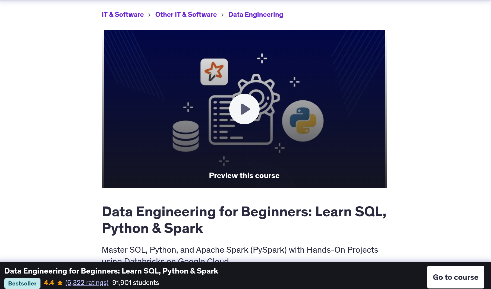  

---

## Wednesday: Midweek Milestones

### Course Progress

Today, I dove into the course we were given and covered several modules. I set up essential software like pgAdmin and PostgreSQL, which was quite an adventure!

I encountered some issues during the installation of pgAdmin, but thankfully, I found a helpful blog post that guided me through the process. The blog [Install and Configure PostgreSQL and pgAdmin on Ubuntu 20.04 | 22.04](https://medium.com/yavar/install-and-configure-postgresql-and-pgadmin-on-ubuntu-20-04-22-04-52c52c249b9e) provided clear steps to install the PostgreSQL server and pgAdmin, which made the setup much smoother.

### Data Concepts

I explored the basics of data lakes and data warehouses, which are crucial for managing large datasets.

### RDBMS Overview

I learned about different types of RDBMS, including MySQL, PostgreSQL, Oracle, and SQL Server. It was fascinating to study the differences between PostgreSQL, MySQL, and NoSQL databases.

 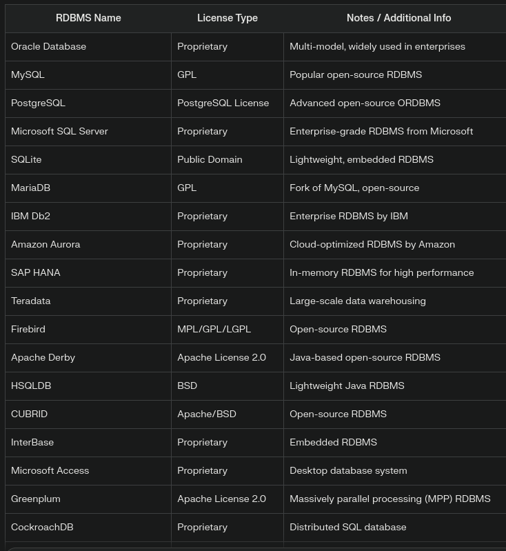

### OLTP vs. OLAP

Understanding the difference between OLTP and OLAP systems was eye-opening, as it highlighted their distinct roles in data processing.

### Big Data Technologies

I touched upon big data technologies like Spark, Hadoop, Kafka, Amazon Redshift, and Google BigQuery, which are pivotal in handling massive data volumes.

   

### SQL vs. NoSQL

I also studied when to use SQL versus NoSQL in a website context. For example, e-commerce platforms use SQL for storing customer orders and NoSQL for catalog management.

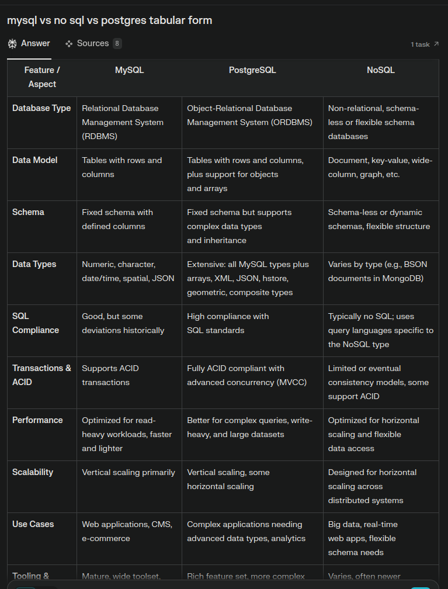  

Interestingly, I learned that both Notion and Uber initially started with PostgreSQL as their database server for handling transactions. However, as the number of users grew, they faced scaling issues with PostgreSQL. This was highlighted in a couple of YouTube videos I watched: [Uber's experience](https://www.youtube.com/watch?v=qGAPokt6Buo) and [Notion's journey](https://www.youtube.com/watch?v=NwZ26lxl8wU). These cases illustrate the challenges of scaling with SQL databases 

  

---

## Thursday: Thoughtful Insights

*Delve into data and derive insights.*

Today was all about diving deeper into PostgreSQL and its ecosystem. Here's what I explored:

- **pgAdmin IDE**: I got to grips with how the pgAdmin IDE works, exploring its interface and features. It's quite user-friendly once you get the hang of it!

  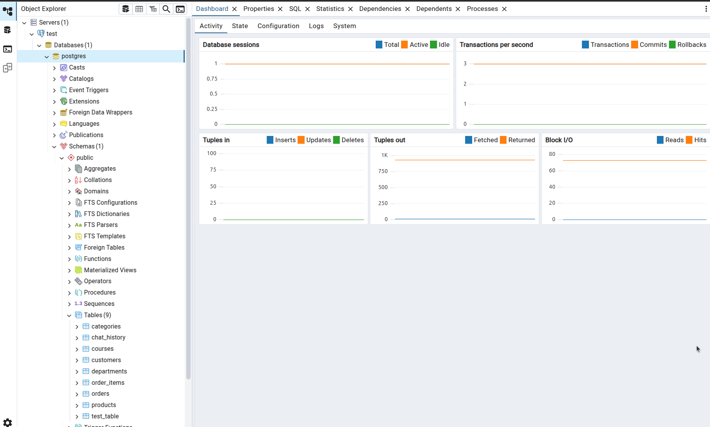  

- **Creating PostgreSQL Servers and Databases**: I learned how to set up PostgreSQL servers, create databases, and manage tables. It's fascinating how everything is interconnected, and the flexibility it offers is impressive.

- **Basic SQL Commands**: I brushed up on basic SQL commands, including window functions. These are super handy for performing calculations across a set of table rows related to the current row.

- **Views and Common Table Expressions (CTEs)**: I delved into views and CTEs, which are great for simplifying complex queries and improving readability. They make handling large datasets much more manageable.

- **Rank Functions**: I explored rank functions, which are perfect for ranking rows in a result set. It's interesting how they can be used to assign a rank to each row within a partition of a result set.

Throughout my studies, I stumbled upon some interesting tidbits, like how CTEs can be recursive, allowing for more complex data retrieval scenarios. It's these little discoveries that make learning so exciting!

---

## Friday: Final Reflections

### Chatbot Adventure

Today, I was feeling a bit bored, so I decided to create a '  Dataverze' chatbot using Langchain-Gemini, JinjaTemplate, Flask, HTML, CSS, and JS. Now, I don't really know JavaScript, so I had to rely on AI to help me out. The chatbot connects to PostgreSQL for real-time data storage using a Python library. This is version 1, and I made sure to maintain package versions in `requirements.txt` and store DB connections and API keys in a `.env` file with a proper project structure.

Future improvements include moving the database to the cloud for storage and implementing a SQL natural language query search, so we can query the DB without any SQL commands using pure natural language! Feedback for improvements is always welcome, and this is just version 1, so many enhancements are on the horizon.

It started with looking something like this , i know i know but i improved.

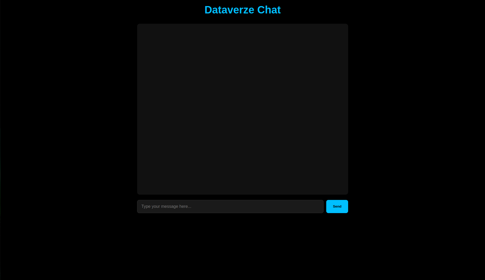

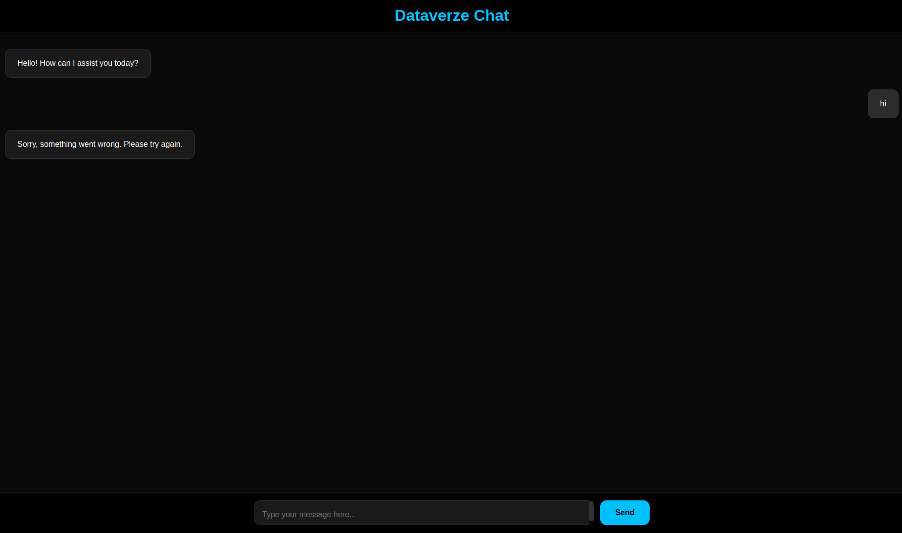

### Challenges and Learnings

While setting up, I faced a few challenges. Not knowing JavaScript was a hurdle, but AI came to the rescue. I shared the chatbot in the group and received a 'Good job!' from my boss.   
        

He even asked for the GitHub repo, but I didn't have one because I was having trouble setting up Git.

That's when I learned about TCP protocols that HTTP methods use and what a personal access token is. I ended up using the SSH protocol because I was having issues with the HTTP one.

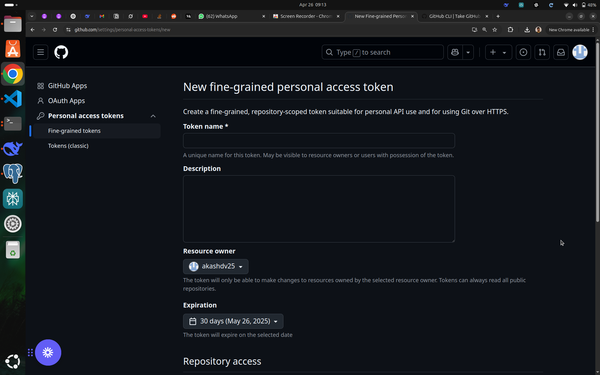

All in all, it was a productive day, and I'm excited about the future improvements!

---

## Saturday: Light Work

*Taking it easy and catching up on small tasks.*

Today was a lighter day, focusing on tying up loose ends from the week. I spent some time reviewing the work done so far and planning for the upcoming week. It was a good opportunity to reflect on the progress made and identify areas for improvement.

I also learned about MCP servers, which had been a bit confusing for me earlier, but I finally got it cleared up. I used some great resources, including YouTube tutorials like [this one](https://youtu.be/dZyQNy3-HjU?si=Jht3TXSNWNflJPBU) and [this one](https://youtu.be/tzrwxLNHtRY?si=XA7ebwe-Ejhsc9NH). Using the documentation, I connected my MCP server to Claude and even did some basic math—just for fun!

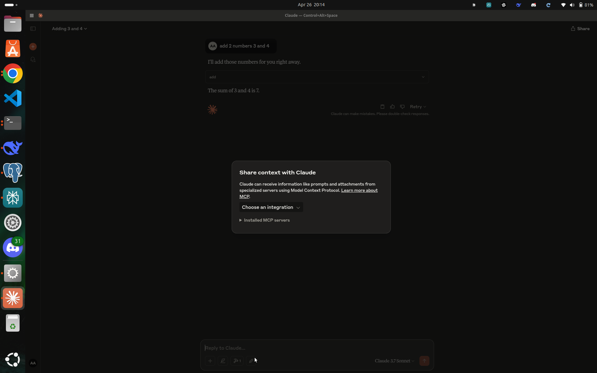

Additionally, I took the time to learn about Git commands and best practices, which will definitely come in handy for future projects.

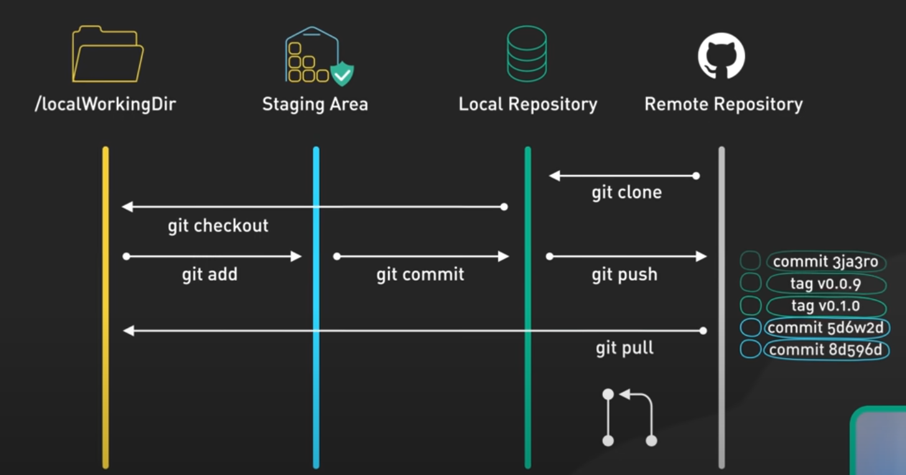

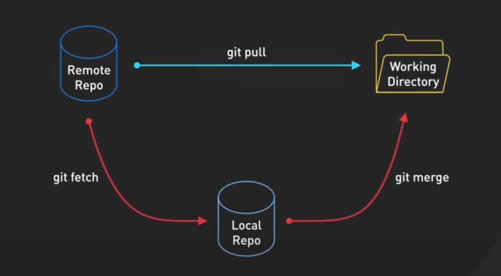

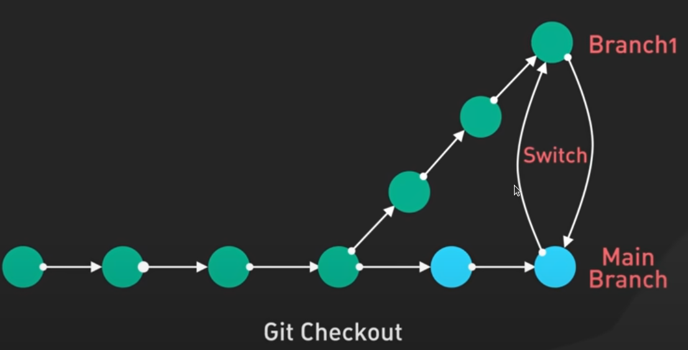

I also explored the differences between `uv pip` and `pip`, which was quite enlightening. Understanding these differences helps in managing Python packages more effectively.

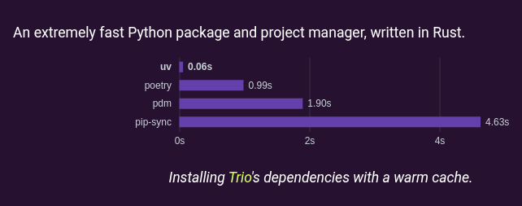

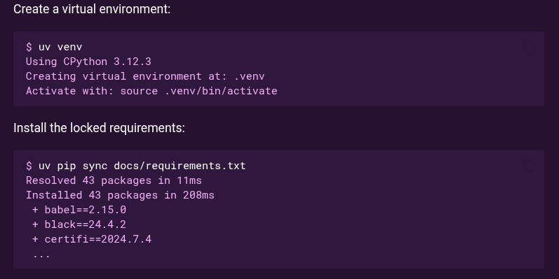

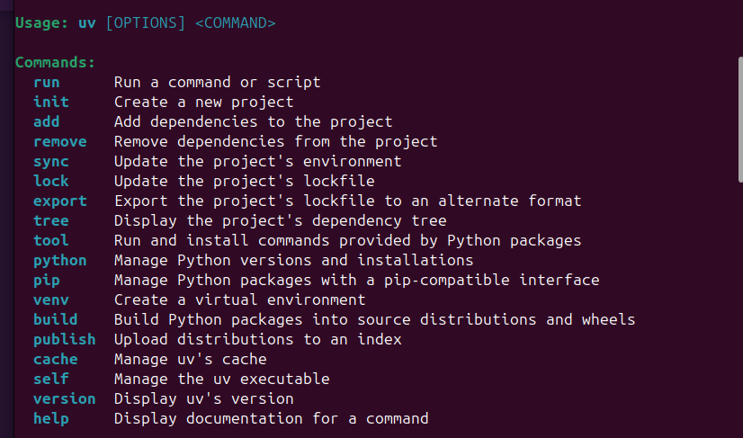

Alrighty, boys and girls, that’s a wrap on our week-1 rollercoaster! 🎢 We’ve cruised through week-1, zoomed past MySQL, and even swung by PostgreSQL’s playground. 

Catch you next week with more cool learnings from my journey into the wild world of databases and beyond. 

Sayonara! 👋✨