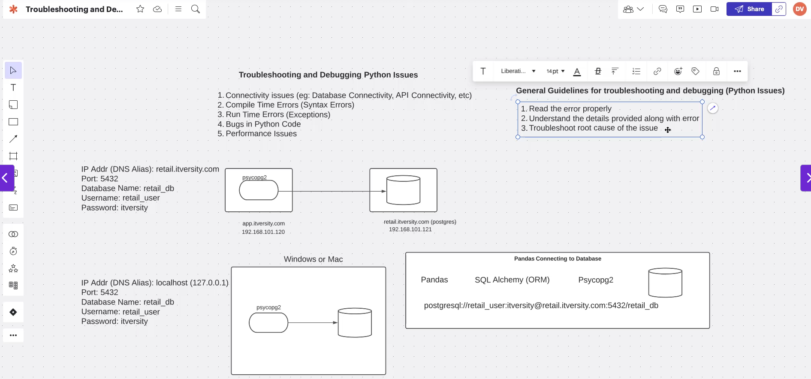
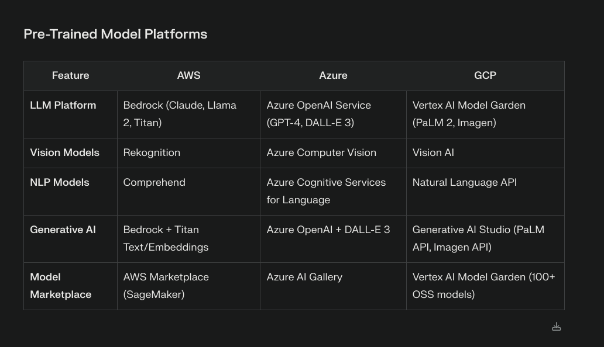

# Week 2 Status Updates

## Monday: Fresh Start

*Beginning the week with new challenges and opportunities.*

### Python Debugging Adventures 🐞

Started the week by diving back into the Udemy course that was handed to us last week. Today's focus was particularly interesting - Python debugging! I learned how to add breakpoints to evaluate how code works, which is like having X-ray vision into your program's execution.

To put this into practice, I created a simple sum function and used VS Code's debugging tools to understand its inner workings. It's fascinating how you can pause the code execution at any point and inspect variables!

Here's what the the process looked like:

This hands-on experience with debugging tools has already made me feel more confident about troubleshooting code issues. It's amazing how these tools can make the debugging process so much more intuitive!

### Diving into Google Cloud Platform ☁️

After getting comfortable with debugging, I decided to explore Google Cloud Platform (GCP). As someone new to cloud computing, I found this really exciting! I discovered a super helpful YouTube video that breaks down GCP for beginners in a really clear way.

Check out the beginner-friendly guide here: [GCP Tutorial](https://youtu.be/OwF9-K5JFb8?si=Bl1Rph4NvJfeHauh)

The way GCP organizes its services and projects is fascinating, I also learnt about 
* what is a VM
* what is a cloud storage
* How apps and database communicate 
* whats sharding
* How the data is spread accross distributed databases 

### Cloud Services Deep Dive 🌐

To broaden my understanding, I watched an excellent video by Neetcode that explains the generic concepts behind all cloud services. It was eye-opening to learn about:
- The commonalities between different cloud providers
- The distinction between global and regional services
- Core offerings that all major cloud platforms provide

This comprehensive overview really helped connect the dots!

Check out Neetcode's explanation here: [Cloud Services Overview](https://youtu.be/gcfB8iIPtbY?si=mvfUwjJ01vrb2KR6)

Understanding these fundamental concepts has given me a solid foundation for working with any cloud platform.

### Data Storage Architecture 📊

Next, I delved into understanding the key differences between data lakes and data warehouses. This exploration was fascinating as it helped me understand how organizations handle different types of data at various scales.

A data lake is like a vast reservoir that can store any type of data in its raw form, while a data warehouse is more like a refined storage system with structured, processed data ready for specific business needs.

Here's a visual comparison that helped me understand the differences:

This knowledge is crucial for understanding modern data architectures and making informed decisions about data storage solutions.

### Cloud Providers Comparison 🌩️

After understanding data storage concepts, I dove into exploring the "Big Three" cloud providers: AWS, Azure, and GCP. Each platform has its unique strengths and specialties, making this comparison really interesting!

#### Amazon Web Services (AWS)
The pioneer in cloud computing, AWS offers the broadest set of services. 

#### Microsoft Azure
Azure's integration with Microsoft's ecosystem is impressive. Got to explore their interface:

#### Google Cloud Platform (GCP)
GCP's strength in data analytics and machine learning is notable. Here's their dashboard:

---

## Tuesday: Deep Dive

*Exploring new concepts and technologies.*

[Content to be added]

---

## Wednesday: Midweek Progress

*Building on knowledge and implementing solutions.*

[Content to be added]

---

## Thursday: Technical Insights

*Diving deeper into advanced concepts.*

[Content to be added]

---

## Friday: Project Day

*Applying knowledge to practical implementations.*

[Content to be added]

---

## Saturday: Review & Reflect

*Taking stock of the week's learning.*

[Content to be added]

---

## Sunday: Planning Ahead

*Preparing for the upcoming week.*

[Content to be added]

---
