# Week 2 Status Updates

## Monday: Fresh Start

*Beginning the week with new challenges and opportunities.*

### Python Debugging Adventures 🐞

Started the week by diving back into the Udemy course that was handed to us last week. Today's focus was particularly interesting - Python debugging! I learned how to add breakpoints to evaluate how code works, which is like having X-ray vision into your program's execution.

To put this into practice, I created a simple sum function and used VS Code's debugging tools to understand its inner workings. It's fascinating how you can pause the code execution at any point and inspect variables!

Here's what the the process looked like:

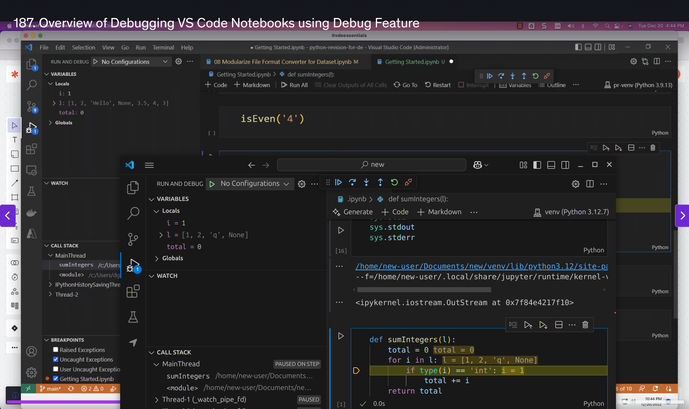

This hands-on experience with debugging tools has already made me feel more confident about troubleshooting code issues. It's amazing how these tools can make the debugging process so much more intuitive!

### Diving into Google Cloud Platform ☁️

After getting comfortable with debugging, I decided to explore Google Cloud Platform (GCP). As someone new to cloud computing, I found this really exciting! I discovered a super helpful YouTube video that breaks down GCP for beginners in a really clear way.

Check out the beginner-friendly guide here: [GCP Tutorial](https://youtu.be/OwF9-K5JFb8?si=Bl1Rph4NvJfeHauh)

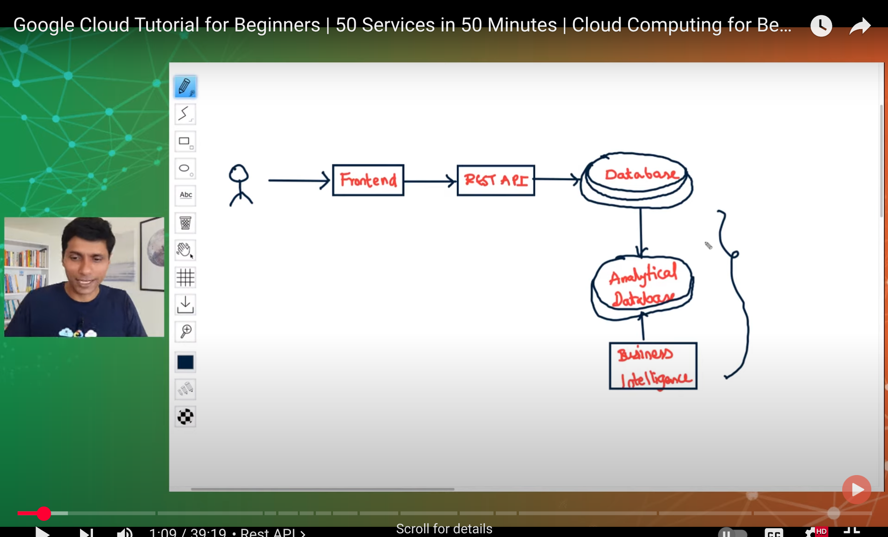

The way GCP organizes its services and projects is fascinating, I also learnt about 
* what is a VM
* what is a cloud storage
* How apps and database communicate 
* whats sharding
* How the data is spread accross distributed databases 

### Cloud Services Deep Dive 🌐

To broaden my understanding, I watched an excellent video by Neetcode that explains the generic concepts behind all cloud services. It was eye-opening to learn about:
- The commonalities between different cloud providers
- The distinction between global and regional services
- Core offerings that all major cloud platforms provide

This comprehensive overview really helped connect the dots!

Check out Neetcode's explanation here: [Cloud Services Overview](https://youtu.be/gcfB8iIPtbY?si=mvfUwjJ01vrb2KR6)

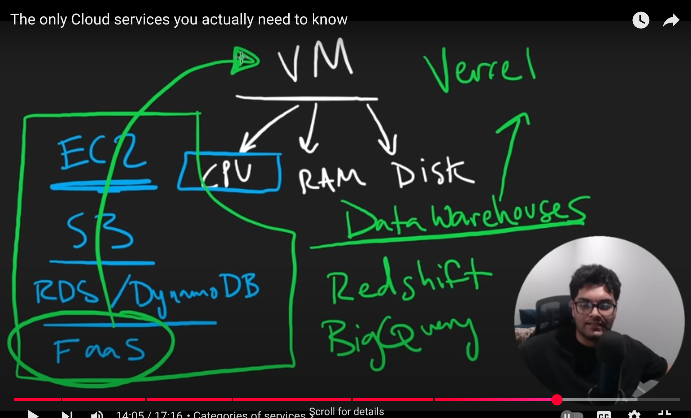

Understanding these fundamental concepts has given me a solid foundation for working with any cloud platform.

### Data Storage Architecture 📊

Next, I delved into understanding the key differences between data lakes and data warehouses. This exploration was fascinating as it helped me understand how organizations handle different types of data at various scales.

A data lake is like a vast reservoir that can store any type of data in its raw form, while a data warehouse is more like a refined storage system with structured, processed data ready for specific business needs.

Here's a visual comparison that helped me understand the differences:

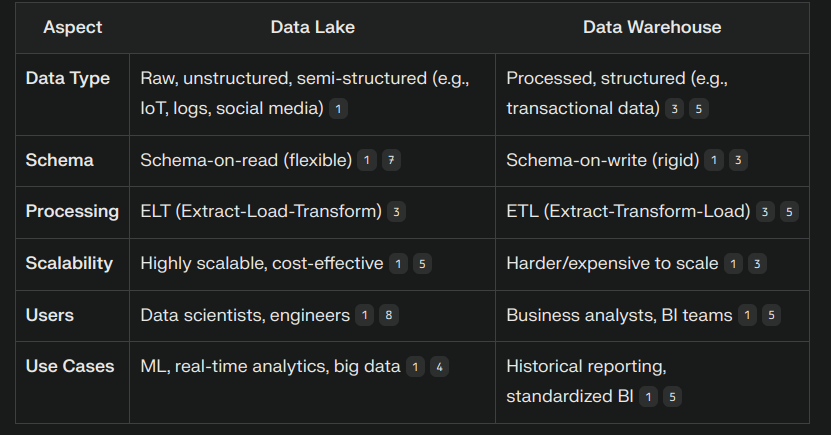

This knowledge is crucial for understanding modern data architectures and making informed decisions about data storage solutions.

### Cloud Providers Comparison 🌩️

After understanding data storage concepts, I dove into exploring the "Big Three" cloud providers: AWS, Azure, and GCP. Each platform has its unique strengths and specialties, making this comparison really interesting!

#### Amazon Web Services (AWS)
The pioneer in cloud computing, AWS offers the broadest set of services. 

#### Microsoft Azure
Azure's integration with Microsoft's ecosystem is impressive. Got to explore their interface:

#### Google Cloud Platform (GCP)
GCP's strength in data analytics and machine learning is notable. Here's their dashboard:

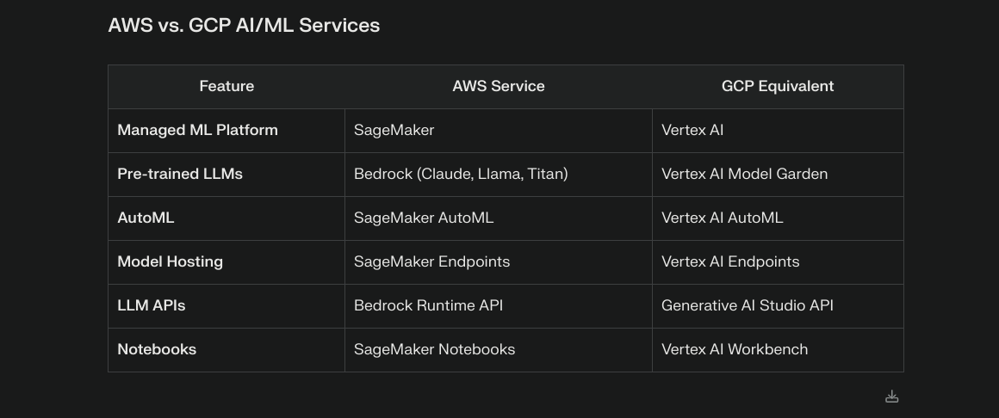

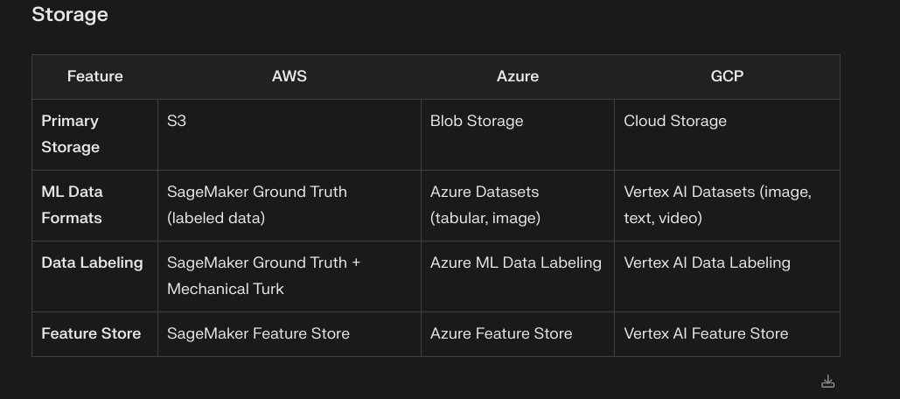

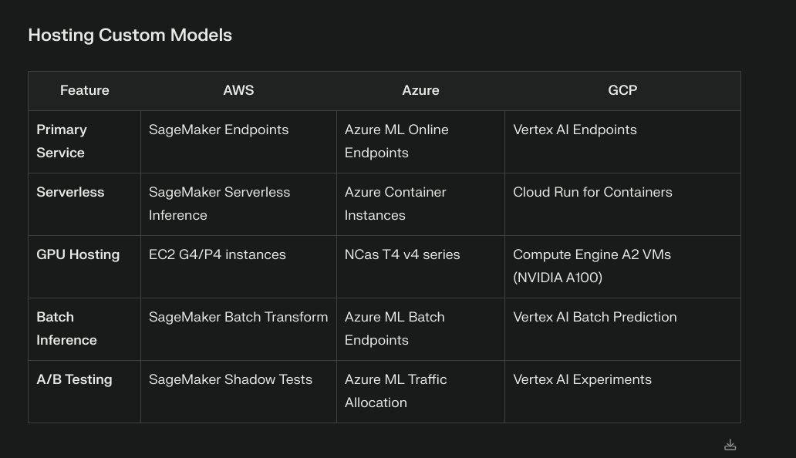

---

## Tuesday: Deep Dive

#### Reverse Knowledge Transfer Presentation: Rising to the Challenge

In a pivotal moment of professional growth, I delivered a reverse knowledge transfer presentation to senior leadership. The atmosphere was electric as I shared my journey of adaptation and triumph. With gratitude in my heart, I began by acknowledging the precious time our seniors invested in hearing our voices.

#### The Ubuntu Chronicles: Conquering New Territories
From the familiar shores of Windows to the uncharted territories of Ubuntu, my journey was nothing short of transformative. The initial days were a dance with uncertainty, but as they say, "smooth seas never made a skilled sailor." I emerged victorious, mastering:

- The intricate world of `.appimage` files
- The power of `.deb` packages
- The commanding presence of `apt`
- The versatility of `snap` package manager

Each challenge was met with unwavering determination, turning obstacles into stepping stones.

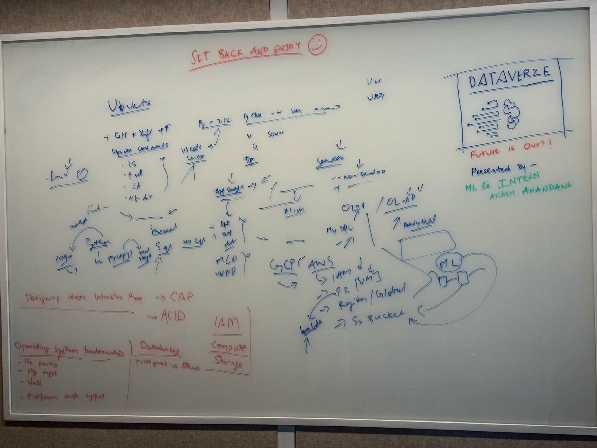

#### Feedback: Pearls of Wisdom
The presentation sparked a cascade of invaluable feedback,(which ofcourse I cant mention in depth here xD) illuminating the path forward. Key focus areas emerged like constellations guiding a night traveler:

- Networking OS
- Python
- SQL
- Data Science Fundamentals
- Prompting
- Cloud Technologies

#### AWS Expedition: Venturing into the Cloud ☁️

The day's journey didn't end with the presentation. Like a determined explorer, I ventured into the vast expanse of AWS, discovering:

#### Core Services Discovered
1. **EC2 (Elastic Compute Cloud)**
   - The beating heart of cloud computing
   - Virtual servers in the cloud

2. **S3 (Simple Storage Service)**
   - The fortress of data storage
   - Buckets of infinite possibilities

3. **IAM (Identity and Access Management)**
   - Crafted a new user account
   - Bestowed administrative powers while maintaining security
   - A strategic move away from root access

#### Key Achievements 🏆
- Successfully delivered an impactful reverse KT
- Explored Ubuntu package management
- Initiated AWS cloud journey
- Implemented IAM best practices

#### Looking Ahead 🔭
Armed with feedback and newfound knowledge, the path ahead is clear. Each step forward is a step toward mastery in this ever-evolving technological landscape. 

---

## Wednesday: AWS Adventures & Big Data Discoveries! 🚀

*Today was an absolute rollercoaster of cloud computing and big data exploration!*

### Morning AWS Shenanigans ☁️

Started my day by diving deep into AWS fundamentals with this awesome tutorial:
[AWS Full Course for Beginners](https://www.youtube.com/watch?v=rKNSc8RrwxA)

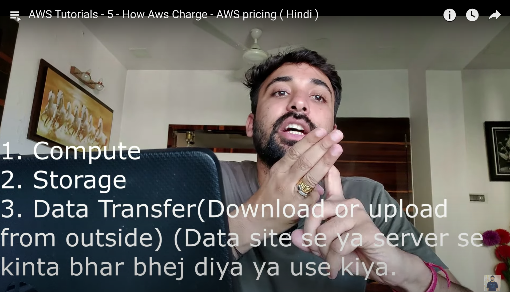

### Virtualization: The Matrix of Cloud Computing 🤯
Learned about virtualization - basically 

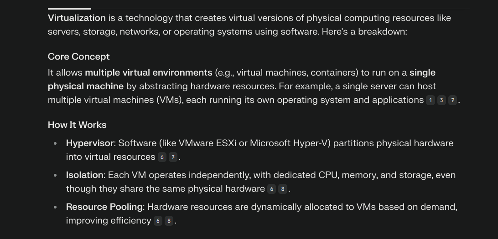

### IAM: My First Steps into AWS Security 🔐
Created my very first IAM user today - felt like getting a VIP pass to the cloud! Gave it admin access because, well, go big or go home! (Don't worry, following best practices! 😉)

### EC2: My Virtual Computer in the Sky! 💻
The excitement was real when I launched my first EC2 instance! Learned about:
- Different EC2 instance types (there are so many!)

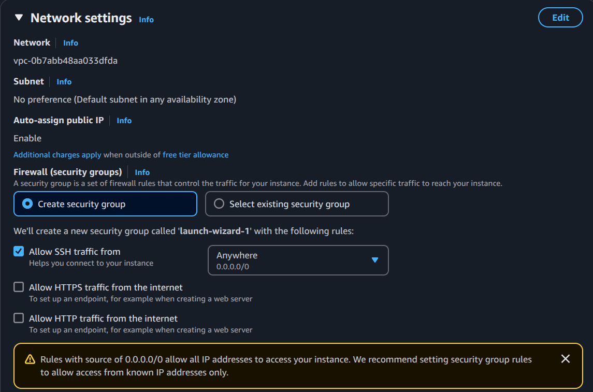

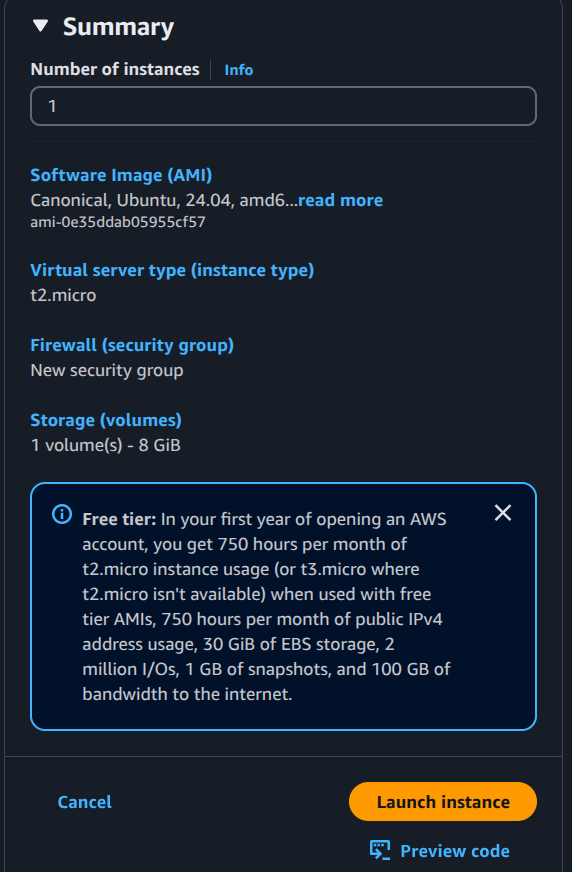
- AMI (Amazon Machine Images) - like choosing your favorite OS flavor
- Selected Ubuntu (keeping it familiar!)

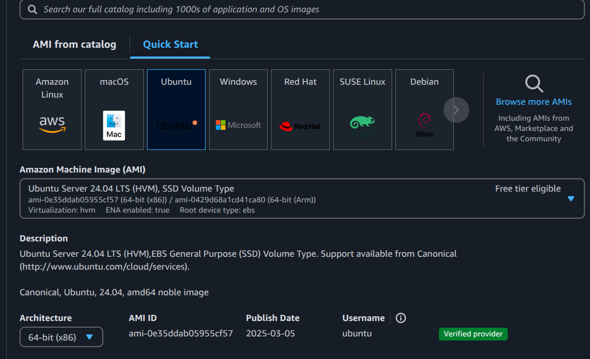

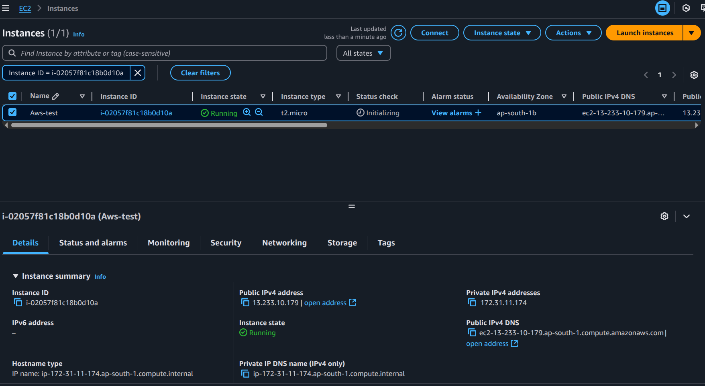

### Security Groups: The Bouncers of the Cloud 🚧
Got to know about security groups in network settings - they're like the cool bouncers who decide who gets in and who doesn't! 

### SSH Adventures: Local CLI meets Cloud CLI 🤝
Successfully connected my local command line to the cloud instance using SSH - felt like a proper cloud ninja! 

### S3 Bucket Brigade! 🪣
- Created my first S3 bucket (it's like a super-powered Dropbox!)

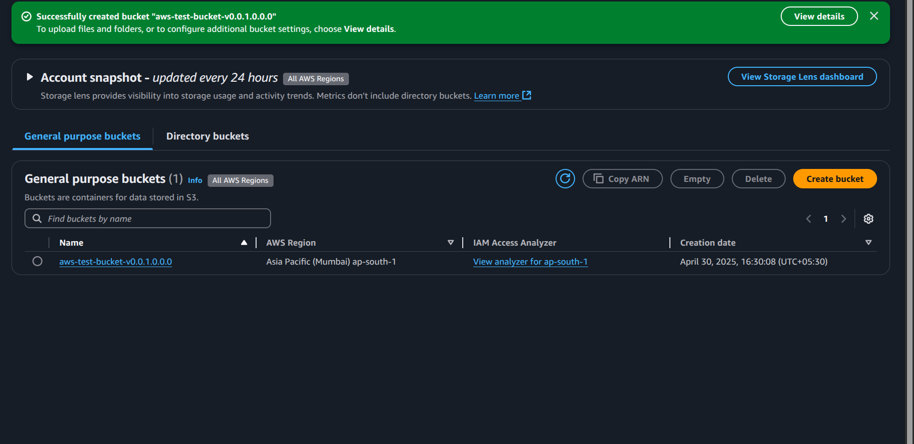

- Uploaded and hosted a static website (Hello World, but make it cloud!)

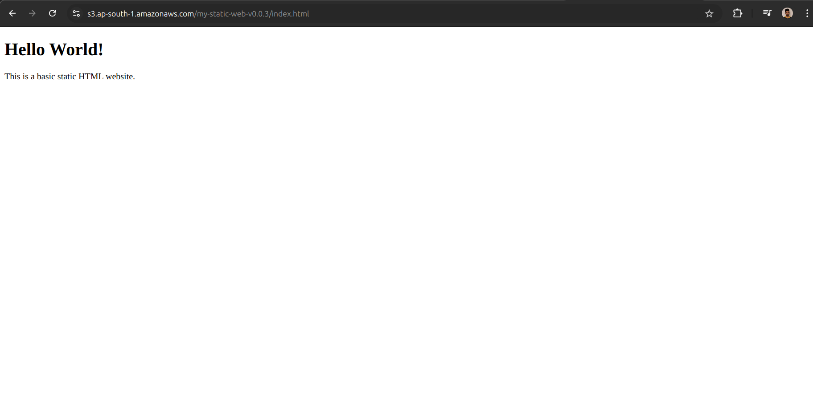

- Wrestled with bucket policies to make the website public (and won! 💪)

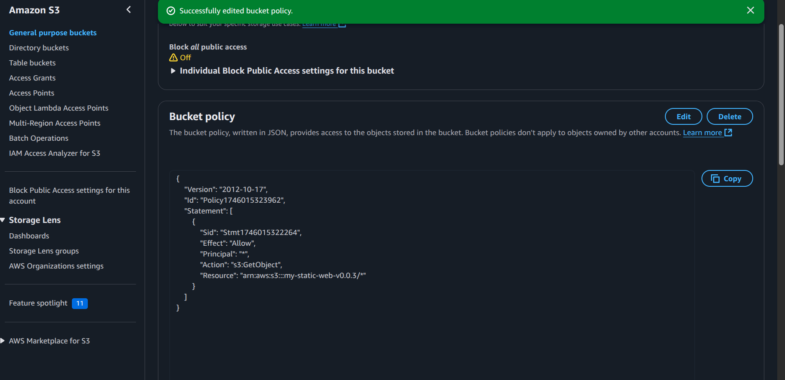

### Quick Visits to Other AWS Services 🎯
- DynamoDB: NoSQL database that scales like crazy
- Amazon RDS: For when you need that traditional database feel
- Lambda: Serverless functions that run on events (magic, basically!)

### Big Data Finale: A Journey Through Time 📚
Ended the day with some mind-bending big data history:

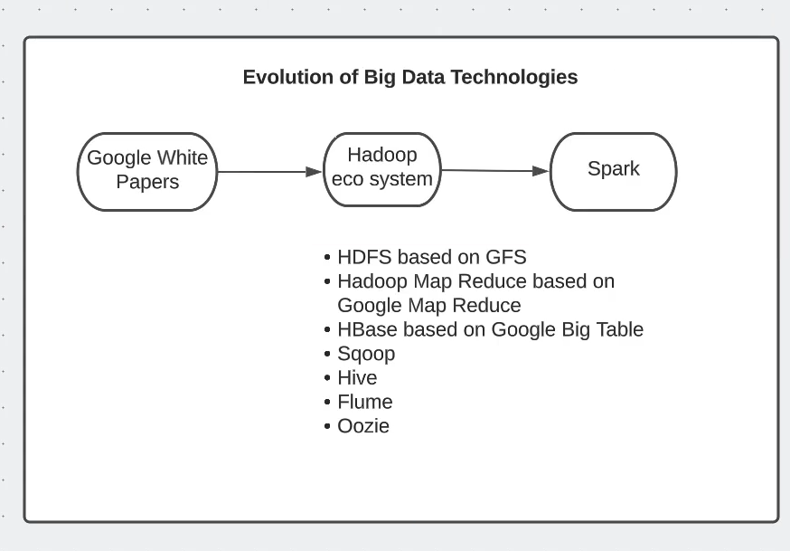

- How Google changed everything with their groundbreaking papers
- MapReduce: The OG of big data processing
- Google File System: Making distributed storage cool
- Hadoop: The elephant that took inspiration from Google
- Apache Spark: The new kid on the block, making big data processing faster than ever!

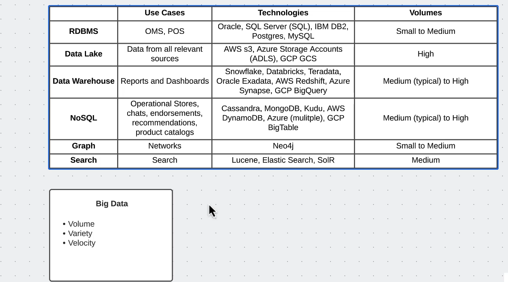

---

## Thursday: Technical Insights

*Diving deeper into advanced concepts.*

[Content to be added]

---

## Friday: Project Day

*Applying knowledge to practical implementations.*

[Content to be added]

---

## Saturday: Review & Reflect

*Taking stock of the week's learning.*

[Content to be added]

---

## Sunday: Planning Ahead

*Preparing for the upcoming week.*

[Content to be added]

---
