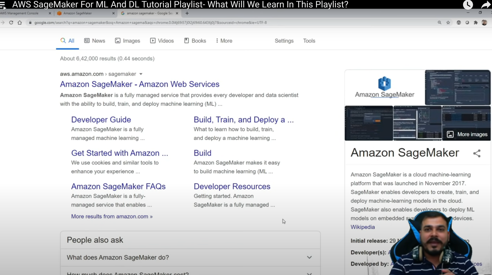
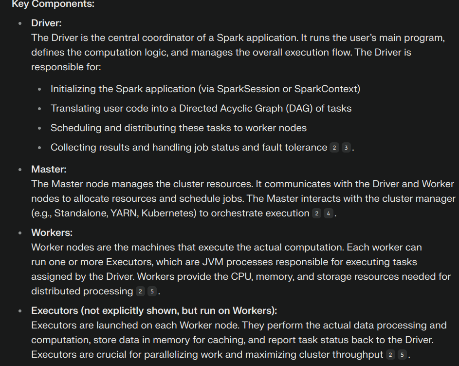
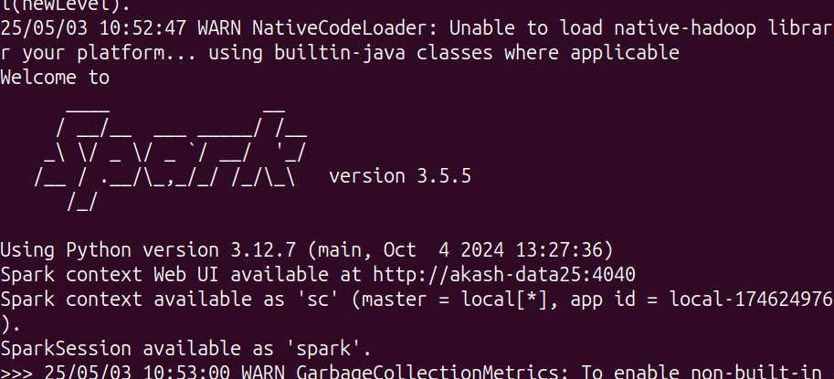

# Week 2 Status Updates

## Monday: Fresh Start

*Beginning the week with new challenges and opportunities.*

### Python Debugging Adventures 🐞

Started the week by diving back into the Udemy course that was handed to us last week. Today's focus was particularly interesting - Python debugging! I learned how to add breakpoints to evaluate how code works, which is like having X-ray vision into your program's execution.

To put this into practice, I created a simple sum function and used VS Code's debugging tools to understand its inner workings. It's fascinating how you can pause the code execution at any point and inspect variables!

Here's what the the process looked like:

This hands-on experience with debugging tools has already made me feel more confident about troubleshooting code issues. It's amazing how these tools can make the debugging process so much more intuitive!

### Diving into Google Cloud Platform ☁️

After getting comfortable with debugging, I decided to explore Google Cloud Platform (GCP). As someone new to cloud computing, I found this really exciting! I discovered a super helpful YouTube video that breaks down GCP for beginners in a really clear way.

Check out the beginner-friendly guide here: [GCP Tutorial](https://youtu.be/OwF9-K5JFb8?si=Bl1Rph4NvJfeHauh)

The way GCP organizes its services and projects is fascinating, I also learnt about 
* what is a VM
* what is a cloud storage
* How apps and database communicate 
* whats sharding
* How the data is spread accross distributed databases 

### Cloud Services Deep Dive 🌐

To broaden my understanding, I watched an excellent video by Neetcode that explains the generic concepts behind all cloud services. It was eye-opening to learn about:
- The commonalities between different cloud providers
- The distinction between global and regional services
- Core offerings that all major cloud platforms provide

This comprehensive overview really helped connect the dots!

Check out Neetcode's explanation here: [Cloud Services Overview](https://youtu.be/gcfB8iIPtbY?si=mvfUwjJ01vrb2KR6)

Understanding these fundamental concepts has given me a solid foundation for working with any cloud platform.

### Data Storage Architecture 📊

Next, I delved into understanding the key differences between data lakes and data warehouses. This exploration was fascinating as it helped me understand how organizations handle different types of data at various scales.

A data lake is like a vast reservoir that can store any type of data in its raw form, while a data warehouse is more like a refined storage system with structured, processed data ready for specific business needs.

Here's a visual comparison that helped me understand the differences:

This knowledge is crucial for understanding modern data architectures and making informed decisions about data storage solutions.

### Cloud Providers Comparison 🌩️

After understanding data storage concepts, I dove into exploring the "Big Three" cloud providers: AWS, Azure, and GCP. Each platform has its unique strengths and specialties, making this comparison really interesting!

#### Amazon Web Services (AWS)
The pioneer in cloud computing, AWS offers the broadest set of services. 

#### Microsoft Azure
Azure's integration with Microsoft's ecosystem is impressive. Got to explore their interface:

#### Google Cloud Platform (GCP)
GCP's strength in data analytics and machine learning is notable. Here's their dashboard:

---

## Tuesday: Deep Dive

#### Reverse Knowledge Transfer Presentation: Rising to the Challenge

In a pivotal moment of professional growth, I delivered a reverse knowledge transfer presentation to senior leadership. The atmosphere was electric as I shared my journey of adaptation and triumph. With gratitude in my heart, I began by acknowledging the precious time our seniors invested in hearing our voices.

#### The Ubuntu Chronicles: Conquering New Territories
From the familiar shores of Windows to the uncharted territories of Ubuntu, my journey was nothing short of transformative. The initial days were a dance with uncertainty, but as they say, "smooth seas never made a skilled sailor." I emerged victorious, mastering:

- The intricate world of `.appimage` files
- The power of `.deb` packages
- The commanding presence of `apt`
- The versatility of `snap` package manager

Each challenge was met with unwavering determination, turning obstacles into stepping stones.

#### Feedback: Pearls of Wisdom
The presentation sparked a cascade of invaluable feedback,(which ofcourse I cant mention in depth here xD) illuminating the path forward. Key focus areas emerged like constellations guiding a night traveler:

- Networking OS
- Python
- SQL
- Data Science Fundamentals
- Prompting
- Cloud Technologies

#### AWS Expedition: Venturing into the Cloud ☁️

The day's journey didn't end with the presentation. Like a determined explorer, I ventured into the vast expanse of AWS, discovering:

#### Core Services Discovered
1. **EC2 (Elastic Compute Cloud)**
   - The beating heart of cloud computing
   - Virtual servers in the cloud

2. **S3 (Simple Storage Service)**
   - The fortress of data storage
   - Buckets of infinite possibilities

3. **IAM (Identity and Access Management)**
   - Crafted a new user account
   - Bestowed administrative powers while maintaining security
   - A strategic move away from root access

#### Key Achievements 🏆
- Successfully delivered an impactful reverse KT
- Explored Ubuntu package management
- Initiated AWS cloud journey
- Implemented IAM best practices

#### Looking Ahead 🔭
Armed with feedback and newfound knowledge, the path ahead is clear. Each step forward is a step toward mastery in this ever-evolving technological landscape. 

---

## Wednesday: AWS Adventures & Big Data Discoveries! 🚀

*Today was an absolute rollercoaster of cloud computing and big data exploration!*

### Morning AWS Shenanigans ☁️

Started my day by diving deep into AWS fundamentals with this awesome tutorial:
[AWS Full Course for Beginners](https://www.youtube.com/watch?v=rKNSc8RrwxA)

### Virtualization: The Matrix of Cloud Computing 🤯
Learned about virtualization - basically 

### EC2: My Virtual Computer in the Sky! 💻
The excitement was real when I launched my first EC2 instance! Learned about:
- Different EC2 instance types (there are so many!)

- AMI (Amazon Machine Images) - like choosing your favorite OS flavor
- Selected Ubuntu (keeping it familiar!)

### Security Groups: The Bouncers of the Cloud 🚧
Got to know about security groups in network settings - they're like the cool bouncers who decide who gets in and who doesn't! 

### SSH Adventures: Local CLI meets Cloud CLI 🤝
Successfully connected my local command line to the cloud instance using SSH - felt like a proper cloud ninja! 

### S3 Bucket Brigade! 🪣
- Created my first S3 bucket (it's like a super-powered Dropbox!)

- Uploaded and hosted a static website (Hello World, but make it cloud!)

- Wrestled with bucket policies to make the website public (and won! 💪)

### Quick Visits to Other AWS Services 🎯
- DynamoDB: NoSQL database that scales like crazy
- Amazon RDS: For when you need that traditional database feel
- Lambda: Serverless functions that run on events (magic, basically!)

### Big Data Finale: A Journey Through Time 📚
Ended the day with some mind-bending big data history:

- How Google changed everything with their groundbreaking papers
- MapReduce: The OG of big data processing
- Google File System: Making distributed storage cool
- Hadoop: The elephant that took inspiration from Google
- Apache Spark: The new kid on the block, making big data processing faster than ever!

---

## Thursday: AI/ML Cloud Adventures! 🤖

*Diving into the fascinating world of AWS's AI and ML services and completing an assignment*

### Amazon SageMaker: Where ML Dreams Come True ✨
Got my hands on SageMaker today - AWS's powerhouse for machine learning! It's like having a full-stack ML workshop in the cloud:
- Build, train, and deploy ML models
- Managed Jupyter notebooks for experimentation

- Automated model training and tuning
- One-click model deployment

### Amazon Bedrock: The LLM Playground 🎮
Explored Bedrock - AWS's newest addition to the AI family! It's like having a VIP pass to the world of Large Language Models:
- Access to pre-trained foundation models

- Played around in the model playground

- Experimented with different prompts and settings

- Discovered various model options and their capabilities

### Boto3: The Python Whisperer 🐍
Got introduced to Boto3 - the Swiss Army knife for AWS automation in Python! This SDK is amazing:
- Control AWS services with Python code
- Automate AWS infrastructure
- Manage resources programmatically
- Interface with AWS services like they're Python objects

### First Assignment: Time to Put Knowledge to Work! 💪
After exploring these awesome AWS services, it was time to tackle my first assignment from my senior !

The requirements were straightforward so I began to work , I explored various repo's to see how production grade code is maintained as I didnt want to submit just anyother assignment I wanted to submit THE ASSIGNMENT , I always make it dramatic XD

After a bit of research I got the idea on how to properly structure my code and present it in a professional manner , so I got to work and ended up with this [github-repo](https://github.com/akashdv25/assignment-1) and this web-page 

with this [webapp-readme](https://akashdv25.github.io/assignment-1/).Pretty exciting stuff for me.

During the assignment learnt about:

* Use of __init__
* Use of Magic methods
* String formatters
* And much more

### Closing out with Intro to Distributed Computing and PySpark 🌟

Ended the day by diving into the fascinating world of distributed computing! Here's what caught my attention:

#### The Evolution: From Hadoop to Spark 🚀
Discovered how the big data landscape evolved:
- Started with Hadoop's revolutionary MapReduce
- Learned why Spark became the cool kid on the block:
  - In-memory processing (way faster than Hadoop's disk-based approach)
  - More flexible than MapReduce's rigid two-step process
  - Support for real-time processing
  - Interactive data analysis capabilities

#### MapReduce: The OG of Distributed Processing 🗺️
Got my mind blown learning about MapReduce:
- How it breaks big problems into smaller chunks (Map)
- Then combines results into final answers (Reduce)
- Like having a massive team working on different parts of the same puzzle!

#### Framework Face-off: Dask vs Pandas vs PySpark 🥊
Compared different distributed computing frameworks:
- Pandas: The trusty old friend for smaller datasets
- Dask: Like Pandas but with superpowers for bigger data
- PySpark: The heavyweight champion for massive-scale data processing

Watched some tutorials to prepare for tomorrow's deep dive into PySpark. Can't wait to get my hands dirty with some real distributed computing! 🔥

---

## Friday: Deep Dive into Spark's Universe! 🌟

*A day of unraveling Spark's architecture and getting hands-on with distributed computing*

### Spark Infrastructure: The Master Plan 🏗️
Discovered the fascinating architecture of Spark:
- Driver Program: The brain of the operation
- Cluster Manager: The orchestrator of our distributed symphony
- Worker Nodes: Our tireless computational warriors
- Executors: The real MVPs doing the heavy lifting

### RDDs: The Building Blocks of Spark Magic ✨
Got mind-blown understanding Resilient Distributed Datasets (RDDs):
- The fundamental data structure of Spark
- How they enable parallel computation
- Their interaction with DBFS (Databricks File System)
- The beauty of fault tolerance

### Hadoop vs Spark: The Speed Revolution 🚀
Understood the key differences:
- Hadoop: Writes to disk (slower but cheaper)
- Spark: Writes to memory (faster but more expensive)
- Why this trade-off matters for different use cases

### Hands-on Adventures 🛠️
Successfully set up my local Spark playground:
- Configured Spark on my system
- Got friendly with JVM (Java Virtual Machine)
- Spun up my first cluster
- Ran queries using Spark SQL on Databricks

### The Art of RDD Operations 🎨
Mastered the two types of RDD operations:
1. Transformations:
   - Lazy evaluated
   - Create a DAG workflow
   - Don't execute until an action is called
2. Actions:
   - Instant execution
   - Trigger the actual computation
   - Return results to driver program

### Key Takeaways 🎯
- Spark's in-memory processing is a game-changer
- RDDs are the secret sauce of distributed computing
- DAG-based execution makes operations efficient
- The trade-off between memory and disk storage is crucial

### Looking Forward 🔭
Today was heavy on theory, but it laid a solid foundation! Can't wait to dive deeper into practical implementations and see these concepts in action! 

---

## Saturday: Hands-on with Spark & Modern Data Tools! 🛠️

*A day of practical exploration and clearing up common confusions*

### Morning CLI Adventures ⌨️
Started the day by getting familiar with Spark on the command line:
- Set up Spark CLI successfully
- Configured the environment
- Got everything running smoothly

### The Evolution: From RDDs to DataFrames 📈
Learned about how Spark data handling evolved:
- RDDs: The original building blocks
- DataFrames: The newer, more user-friendly approach
- Key differences:
  - DataFrames are like tables with columns and rows
  - More optimized than RDDs
  - Easier to work with 
  - Used more commonly in modern Spark applications

### Databricks Playground Time! 🎮
Had fun exploring Databricks:
- Loaded up some DataFrames
- Ran different types of queries
- Got comfortable with the interface
- Learned how to analyze data efficiently

### Diving into Data Lakes & Delta Lake 🌊
Discovered the world of modern data storage:
- Data Lakes: The big pool of raw data
- Delta Lake: The smart upgrade to data lakes
  - Built on top of Parquet files
  - Adds cool features like:
    - Version control for your data (like Git for data!)
    - ACID transactions (keeping data safe and consistent)
    - Time travel (go back to previous versions)
    - Schema enforcement (keeping data clean)
    - Batch and realtime dataprocessing

### Clearing Up the PySpark vs Hadoop Confusion 🤔
Finally understood the big picture:
- Hadoop isn't just MapReduce:
  - It's a whole family of tools
  - Includes HDFS (for storage)
  - Has YARN (for resource management)
  - MapReduce is just one part
- PySpark is specifically a data processing engine
  - Can actually work together with Hadoop
  - Uses Python to make data processing easier
  - Often faster than MapReduce for many tasks

### Hands-on with PySpark 🐍
Completed some tutorials to understand:
- Basic data operations
- How to read and write data
- Running SQL queries
- Data transformations

### Key Learnings 🎯
- DataFrames make life easier than raw RDDs
- Delta Lake adds super useful features to data lakes
- Hadoop and PySpark can be friends, not rivals
- Modern data tools focus on making things simpler and faster

---

## Sunday: The Great AWS Billing Adventure! 💰

*What started as a normal coding day turned into an AWS billing investigation!*

### Morning Spark Session ⚡
Started the day productively with local Spark experiments:
- Spun up a Spark session
- Performed basic data manipulations
- Completed this [playlist](https://youtube.com/playlist?list=PLZoTAELRMXVNjiiawhzZ0afHcPvC8jpcg&feature=shared) by krish naik on Pyspark Handson
- Check out the experiments here: [Experiment.ipynb](Experiment.ipynb)

### The Plot Twist: AWS Bill Discovery! 😱
While preparing to start an assignment, discovered an unexpected AWS bill from my practice sessions. 

### The Investigation Journey 🔍
Dug deep into AWS console to find the issue:
1. SageMaker Services:
   - Found active domain services
   - Promptly deleted them
2. IAM Cleanup:
   - Discovered ~30 active roles
   - Cleaned them all up
3. Network Resources:
   - Found an active NAT Gateway (sneaky!)
   - Spotted and removed an Elastic IP
   - Terminated all unnecessary services

### The Plot Thickens! 📈
- 5 hours after cleanup: Bill jumped to $3!
- Tried accessing Cost Explorer for detailed analysis on hourly timeframe
- Plot twist: Hourly timeframe Cost Explorer itself is a paid service 🤦‍♂️
- Raised support ticket for investigation
- Had a long discussion on all this issue with my senior Amit sir who guided me along the way and made me reaslise the importance of all these events.

### Silver Linings ✨
Even though the original assignment had to wait, learned valuable lessons:
- AWS resource management
- Importance of regular cleanup
- Cost monitoring best practices
- Debugging AWS billing
- As they say, "Best $4 spent on learning!" 😅

### Action Items for Next Week 📝
- Continue investigating billing mystery
- Keep monitoring AWS resources
- Get back to the planned assignment
- Stay excited for more learning at Dataverze!

### Final Thoughts 💭
What started as a billing surprise turned into an intensive learning experience about AWS resource management. Looking forward to Week 3 with excitement 🚀

---
