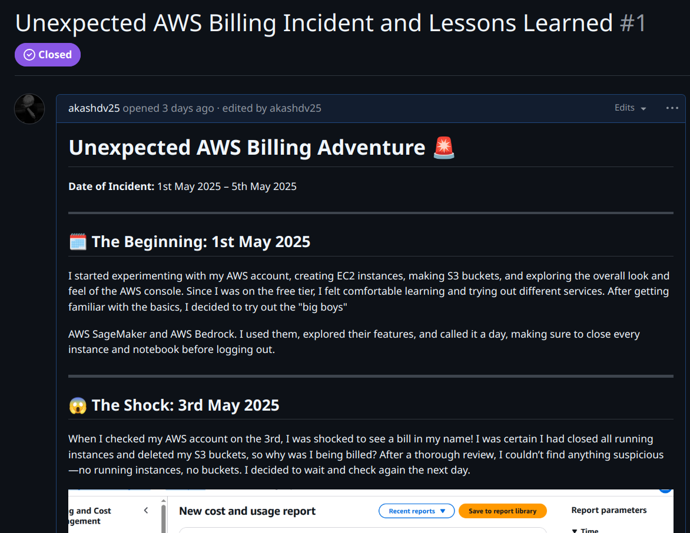
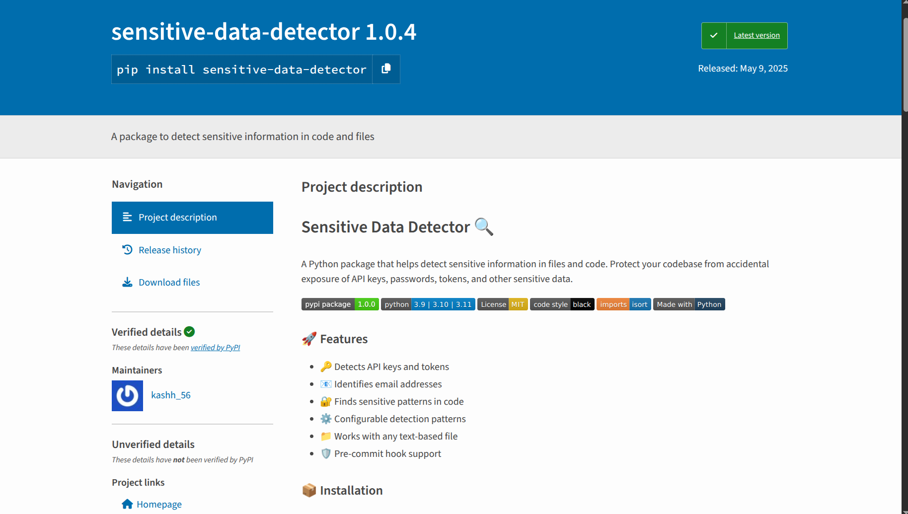
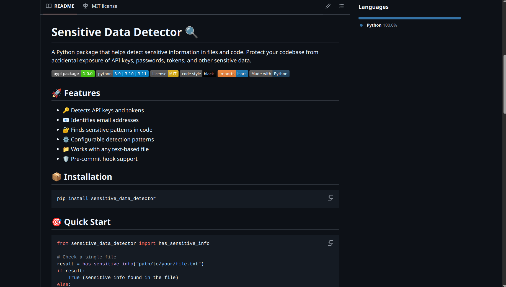
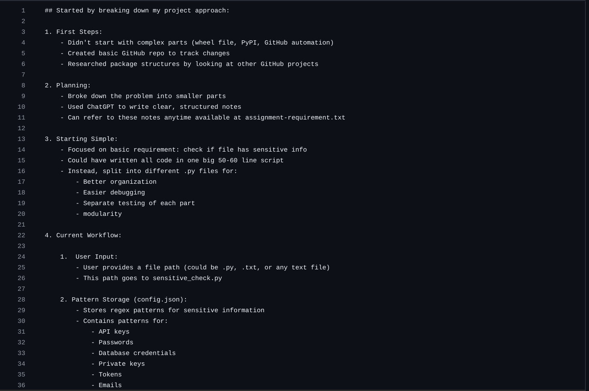
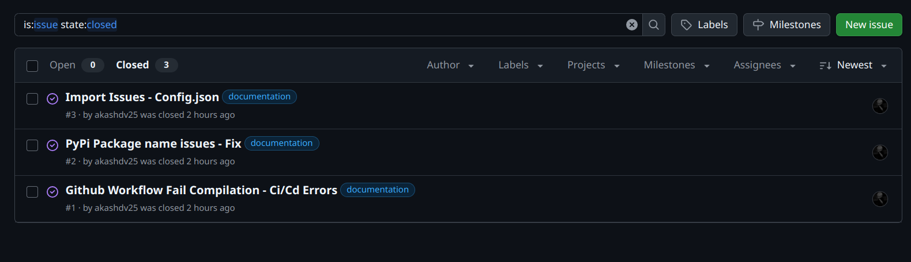
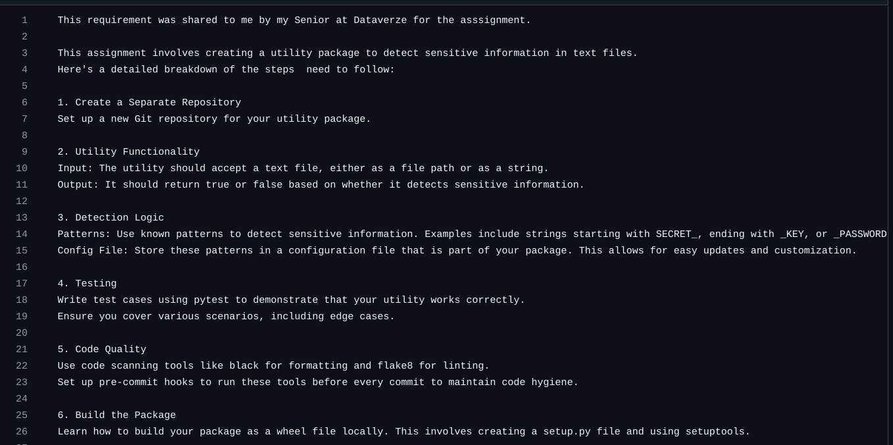
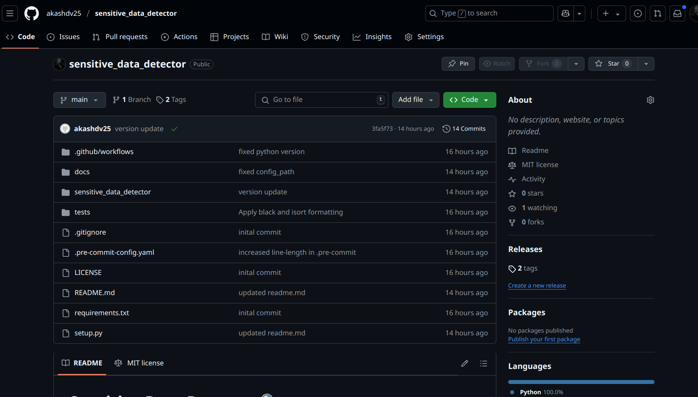
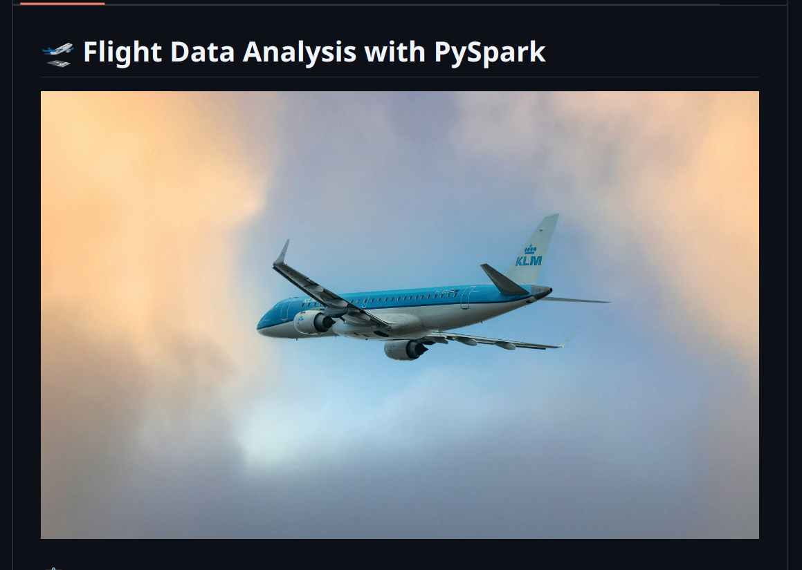

# Week 3 Status Updates
## Monday: Let's Get Started! 😎
### Morning Session ⚡

- **Sandeep Sir's PySpark Assignment:**  
  Went through the use case and started working on the assignment. It was a great way to dive into PySpark and understand its practical applications.
  Researched some notebooks and the apt use case for the same

### Afternoon Deep Dive 💡

- **Amit Sir's Project Breakdown:**  
  Broke down the project into smaller, manageable chunks. Created a clear project structure and started working on building the package. It's still a work in progress, but the foundation is set!

### Evening Exploration 🔍

- **Python Package Research:**  
  Surfed through various Python package repositories to get ideas and inspiration. It was helpful to see how other developers structure their projects and manage dependencies.

  

---

*Overall, it was a productive day heavy on research can't wait to start coding* 🌟

## Tuesday: Building Knowledge 📚

- **Explored PySpark and DataFrames:**  
  Today, I learned about PySpark, a powerful tool for big data processing using Python. I understood what DataFrames are in PySpark—they are like tables in a database, making it easy to organize and analyze large datasets.

- **Dived into PySpark SQL:**  
  I discovered how PySpark SQL lets you run SQL queries on your data directly within PySpark. This is super helpful for filtering, grouping, and transforming data using familiar SQL commands.

- **Mastered DataFrame API Syntax (Window Functions):**  
  I focused on the syntax of the PySpark DataFrame API, especially window functions. Window functions allow you to perform calculations across a set of rows related to the current row, which is useful for tasks like running totals, moving averages, and ranking.

- **Completed PySpark Assignment:**  
  I finished my PySpark assignment, where I applied what I learned about DataFrames and window functions. I explained my approach,  and provided a link to my exploratory data analysis (EDA) for reference.

  [PySpark Assignment](https://github.com/akashdv25/PySpark-EDA)

  
- **Discovered GitHub Issues:**  
  I learned how to use the GitHub Issues feature to track and document problems or events. I created a detailed issue about my unexpected AWS billing experience, describing what happened, how I investigated, and the steps I took to resolve it.

  [AWS Billing Github-Issue](https://github.com/akashdv25/status-updates/issues/1)

  

- **Basics of Operating Systems (Processes, Cores, and Threads):**  
  I also explored some operating system basics. I learned what processes are (programs running on your computer), what CPU cores do (the brains that run your programs), and how threads allow a program to do multiple things at once.

*Another productive day full of learning and hands-on experience!* 🚀

---

## Wednesday: Midweek Development

*Diving deeper into technologies.*

### Morning Knowledge-Sharing Session 📚

Our team gathered for an comprehensive discussion about distributed computing, with valuable insights from everyone:

#### Big Data Fundamentals
- Kanchan and Udit kicked off by explaining big data basics
- Discussed the evolution of data processing needs
- Explored how big data changed the computing landscape

#### Distributed Computing History 🕰️
Sandeep Sir and Amit Sir guided us through:

- **Storage Evolution:**
  - The initial challenges of distributed computing
  - How storage and compute separation affected performance
  - Impact of network I/O bottlenecks on data transfer
  - Comparison between HDD and SSD performance implications

#### HDFS Deep Dive 🗄️
Learned about Hadoop Distributed File System (HDFS):

- **Architecture Components:**
  - NameNode: Manages metadata and system coordination
  - DataNode: Handles data storage and reporting
  - HeartBeat mechanism for node communication
  - Fault tolerance and scalability features

- **Data Management:**
  - Block size considerations in HDFS
  - Data replication strategies
  - Distribution across clusters
  - Single point of failure considerations

#### MapReduce & Resource Management 🔄
Explored the fundamentals of distributed processing:

- **MapReduce Framework:**
  - Programming model for parallel processing
  - Job execution flow and stages
  - Role of JobTracker and TaskNode

- **YARN (Yet Another Resource Negotiator):**
  - Job orchestration mechanisms
  - Resource allocation strategies
  - Cluster management capabilities

#### Data Storage Evolution 📊
Discussed different data storage paradigms:
- Databases
- Data Warehouses
- Data Lakes
- Their roles in modern data architecture

### AWS Billing Resolution Call 📞

**Great News:** Received a call from AWS Support regarding the unexpected billing issue!

#### Call Details 💬
- Explained the complete timeline of events:
  - How I was experimenting with various AWS services
  - The discovery of unexpected charges
  - My investigation process and findings
  - Steps taken to terminate all running services
  - The thorough cleanup of resources (NAT Gateway, Elastic IPs, SageMaker domains)

#### Key Points Discussed 🔍
- **Missing Notifications:**
  - Highlighted that I didn't receive the zero-budget bill notification
  - This was crucial as it could have alerted me earlier about exceeding free tier limits

#### Support Representative's Response 🤝
- The support representative seemed puzzled by the situation
- They noted:
  - The complexity of interconnected services
  - The absence of budget notifications
  - My proactive approach in investigating and resolving the issue
- After reviewing all details, they decided to approve a waiver for the charges

#### Resolution ✨
- Full waiver approved for the unexpected charges
- For more details, check out my detailed documentation here: [AWS Billing Incident Report](https://github.com/akashdv25/status-updates/issues/1)

### Evening Project Kickoff 🚀

#### Python Package Assignment
Started warming up for Amit Sir's assignment:
- **Project Goal:** Create a professional Python package
- **Initial Phase:** 
  - Understanding package requirements
  - Researching package structure best practices
  - Planning the development approach

> *Ended the day by laying the groundwork for tomorrow's development* 📦 ✨

---

## Thursday: Implementation Day

### Python Package Development Marathon 🏃‍♂️

#### Project Completion 🎯
Dedicated the entire day to completing the Python package assignment. It was an intensive learning experience!

#### Technical Implementation 🛠️
- Worked with crucial package components:
  - `setup.py` configuration
  - `egg_info` package metadata
  - CI/CD workflows implementation
  - Package distribution setup

  

  

#### Documentation & Resources 📚
- **Detailed Documentation of development journey:** [Project Documentation Link](https://github.com/akashdv25/sensitive_data_detector/blob/main/docs/documenting_code.txt)

  

- **Issue Tracking:** [GitHub Issue - Development Challenges](https://github.com/akashdv25/sensitive_data_detector/issues)

  

- **Additional Resources:** [Project requirements](https://github.com/akashdv25/sensitive_data_detector/blob/main/docs/assignment-requirement.txt)

  

- **Project Github repo link:** - [sensitive_data_detector](https://github.com/akashdv25/sensitive_data_detector)

  

- **PyPi link:** - [sensitive_data_detector](https://pypi.org/project/sensitive-data-detector/)

#### Key Learnings 💡
All the challenges, solutions, and implementation details are thoroughly documented in the GitHub repository. Check out:
- Package structure best practices
- Development workflow
- Common pitfalls and solutions
- CI/CD pipeline setup

> *A full day of coding, learning, and documentation!* ✨

---

## Weekend: PySpark Flight Data Analysis Project

This weekend, I worked on an exciting PySpark project analyzing flight data! Here's what I learned and accomplished:

### Project Overview
- Created a data analysis project using flight data from 2015
- Built the entire project using PySpark for big data processing
- Made my Jupyter notebook look really nice with clear sections and explanations

### Technical Skills Learned
1. **Repartitioning in PySpark**
   - Learned how to better organize data across partitions
   - Used repartition() to control how data is split up
   - This helps make my queries run faster

2. **User Defined Functions (UDF)**
   - Created my own custom functions in PySpark
   - Learned the proper syntax for UDFs
   - Used them to create new columns and transform data
   - Also compared them with native pyspark functions and got to know how they are slower than normal pyspark functions

3. **Broadcast Joins**
   - Discovered how to make joins more efficient
   - Used broadcast joins when joining large and small tables
   - This really helps speed up my data processing

### Data Analysis
- Analyzed flight delays across different airlines
- Found interesting patterns about which airports have most delays
- Worked with a large dataset and learned how to handle it efficiently

### Project Structure
- Organized my code properly in different files
- Created clear documentation
- Made my notebook easy to read with good markdown sections
- Added comments to explain complex parts of the code

You can check out my project here: [PySpark Flight Data Analysis](https://github.com/akashdv25/PySpark-EDA-Flights-Data)

This weekend project really helped me understand PySpark better and improved my data analysis skills!

---
👋 Sayonara! See you next week for more exciting learning adventures! ✨
