# Week 4 Status Updates

## Monday: Refactoring Adventures

### Python Package Development Code Refactoring 🏃‍♂️

#### Morning Session 🌞
Started the day with a focus on refactoring the code base of sensitive_data_detector package based on the feedback from Amit Sir, making it more efficient and readable learnt how to introduce OOPS concept in the code.


#### Technical Improvements 💪 
- Worked with crucial package functions:
  - Introduced `SensitiveCHecker` Class
  - Introduced various other classes to include OOPS concepts `FileReader` ,`ContentAnalyzer` , `PatternLoader` 
  - Inside each class , introduced methods to handle the file operations, content analysis, pattern matching, etc.
  
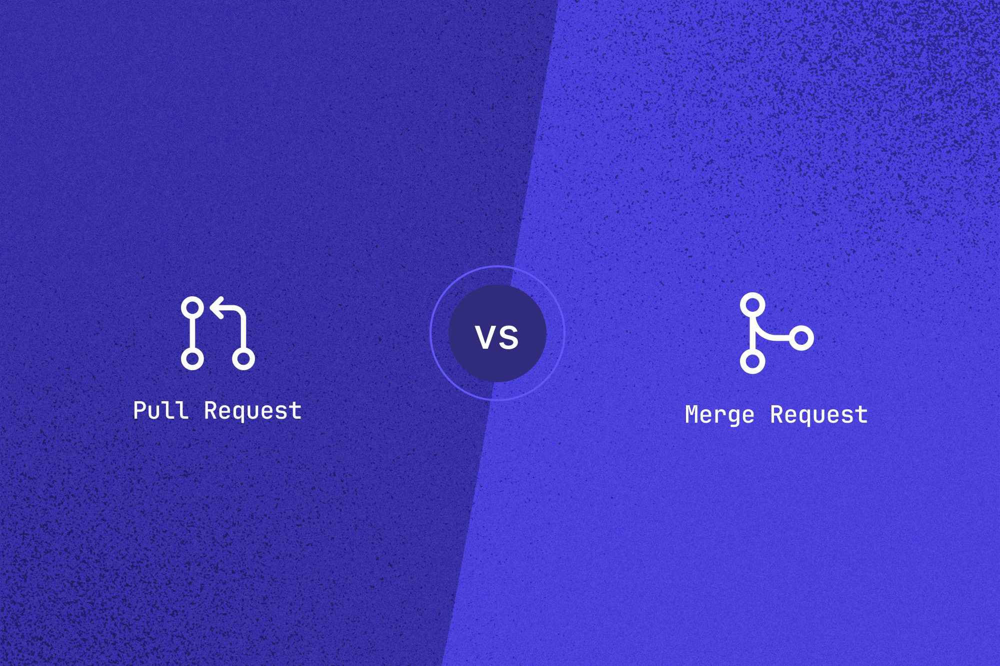 

#### Pull Request & GitHub Issues 📚
- **Detailed Documentation of Feautre Enhancements:** 
Proposed Feature Enhancements in the project by opening a github issue , mentioned all the details about the feature and the implementation plan
    [Github Feature Request Documentation Link](https://github.com/akashdv25/sensitive_data_detector/issues/4)

  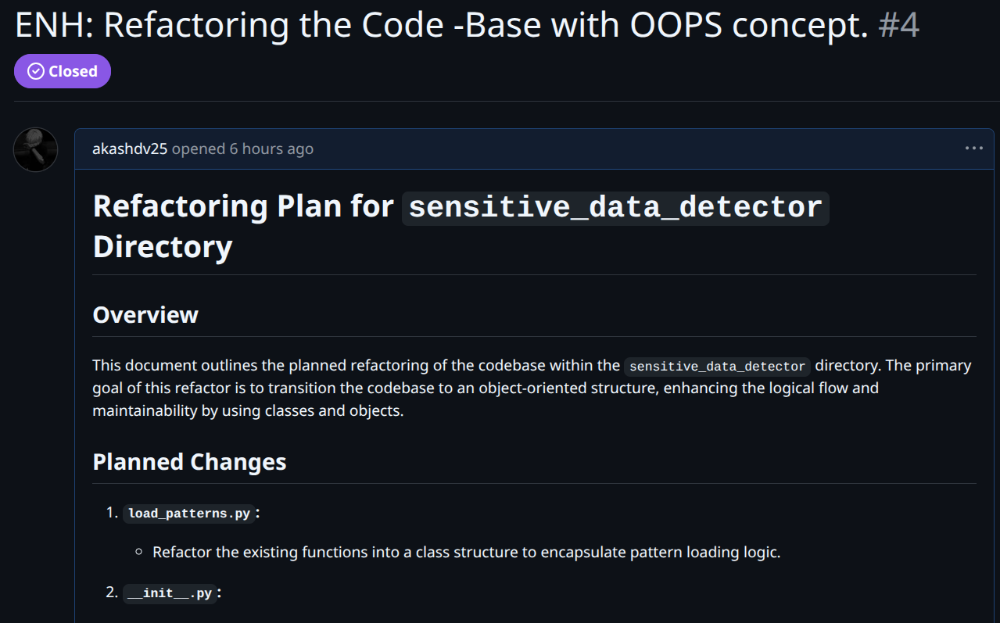

- **Pull Request :** 
After refactoring the code base went ahead and made a PR to merge the changes

    [GitHub Pull Request Link](https://github.com/akashdv25/sensitive_data_detector/pull/5)

  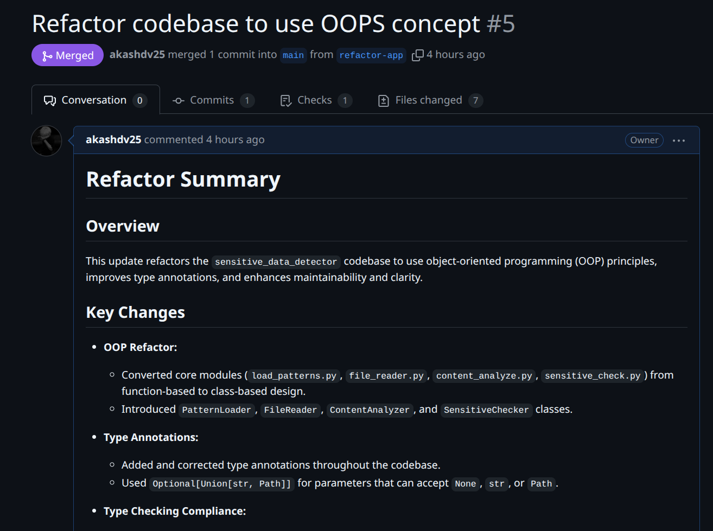


- **Ci-Cd Success :** 
After refactoring the code base and raising the PR , went ahead and checked the CI-CD pipeline to ensure the code is working as expected , it was a success.

 

  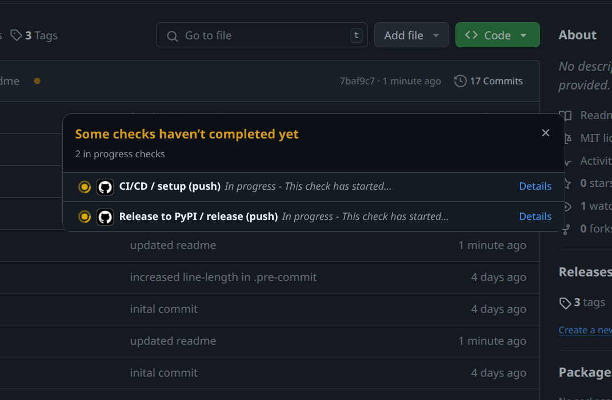

  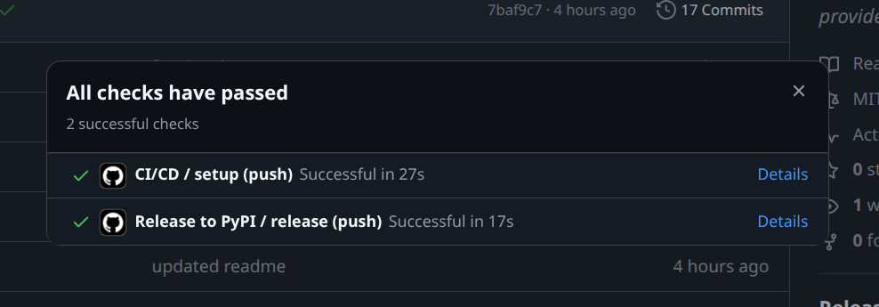

#### Hovering over Licenses 📝

- Learnt about the different types of licenses and their purposes
  
  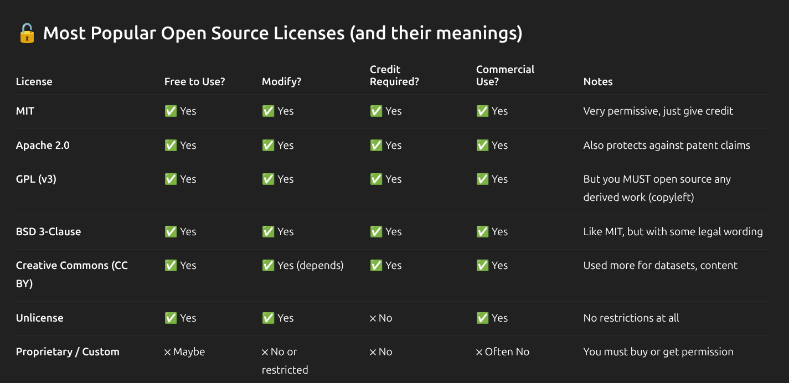

  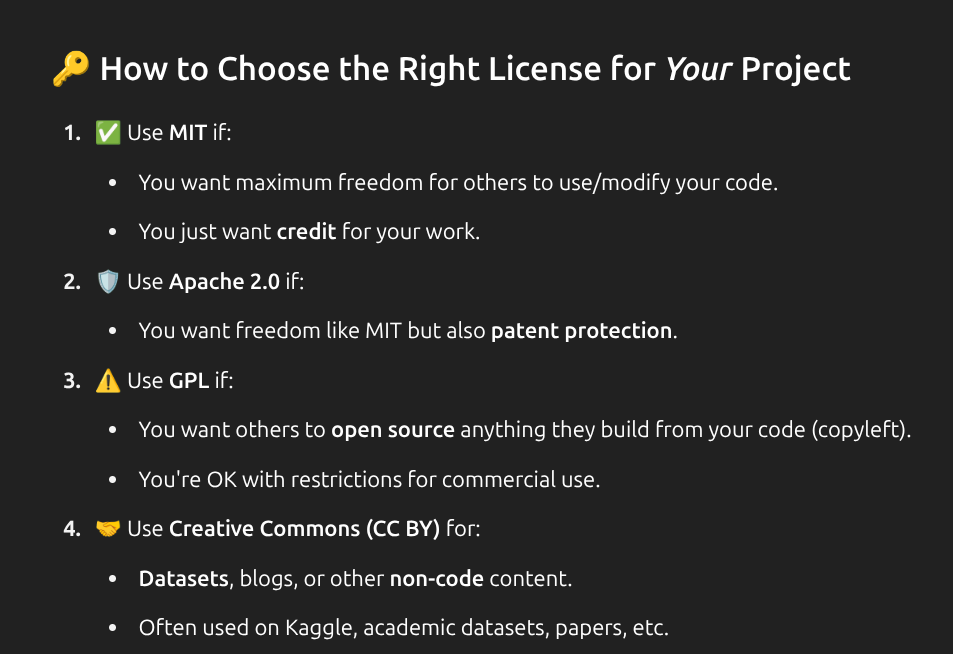

  

#### Learnings 🎯
Today I learnt about:
- Object oriented approach to code refactoring
- How to introduce OOPS concepts in the code
- Implementing code logic in the classes

> *A day of overcomming challenges and refactoring!* 📈


---
## Tuesday: Open Source & Learning Journey 📚

### Morning Inspiration 🌟
- Received surprise books from Amit sir! 
- One focused on system design concepts other on ML by statquest Joshua Starmer the fascinating thing it was a signed copy from him 

  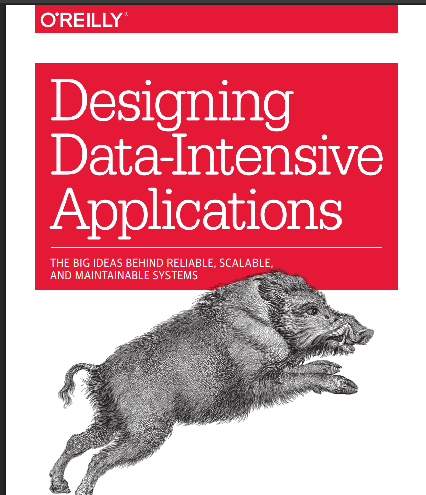

  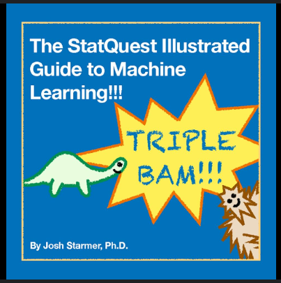

- I even tagged him on twitter and he replied to me !!

  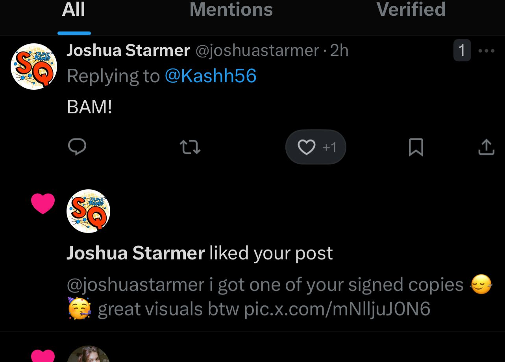

### Mentorship Session 💭
Had an insightful session with Amit sir and Div sir where:
- Discussed our current progress and activities
- Amit sir shared valuable lessons from his tech journey
- Key takeaway: Despite obstacles, learning to enjoy the process and believing in yourself is crucial

### Technical Deep Dive 🛠️
#### Pandas Local Setup
- Successfully set up Pandas locally for open source contributions
- Learned about build tools:
  - Meson and Ninja build systems
  - CPython internals
  - Why we're moving from setuptools to meson
  - Migration from setup.py to pyproject.toml

  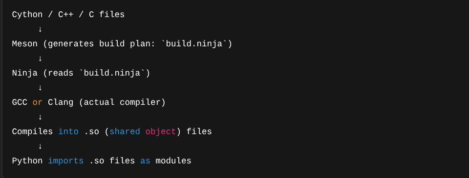

#### Open Source Contribution Prep
- Explored Pandas repository's issues section
- Studied:
  - Contribution guidelines
  - Merged PR commits
  - Best practices for commit messages
  - Writing effective PR descriptions

  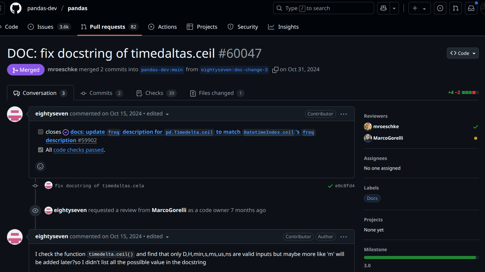

### Blog Writing ✍️
Wrote a detailed guide on setting up Pandas locally:
- Published on Medium: [Setup Pandas Locally for Open Source Contributions](https://medium.com/@akashanandani.56/setup-pandas-locally-for-open-source-contributions-582fba71ec55)

  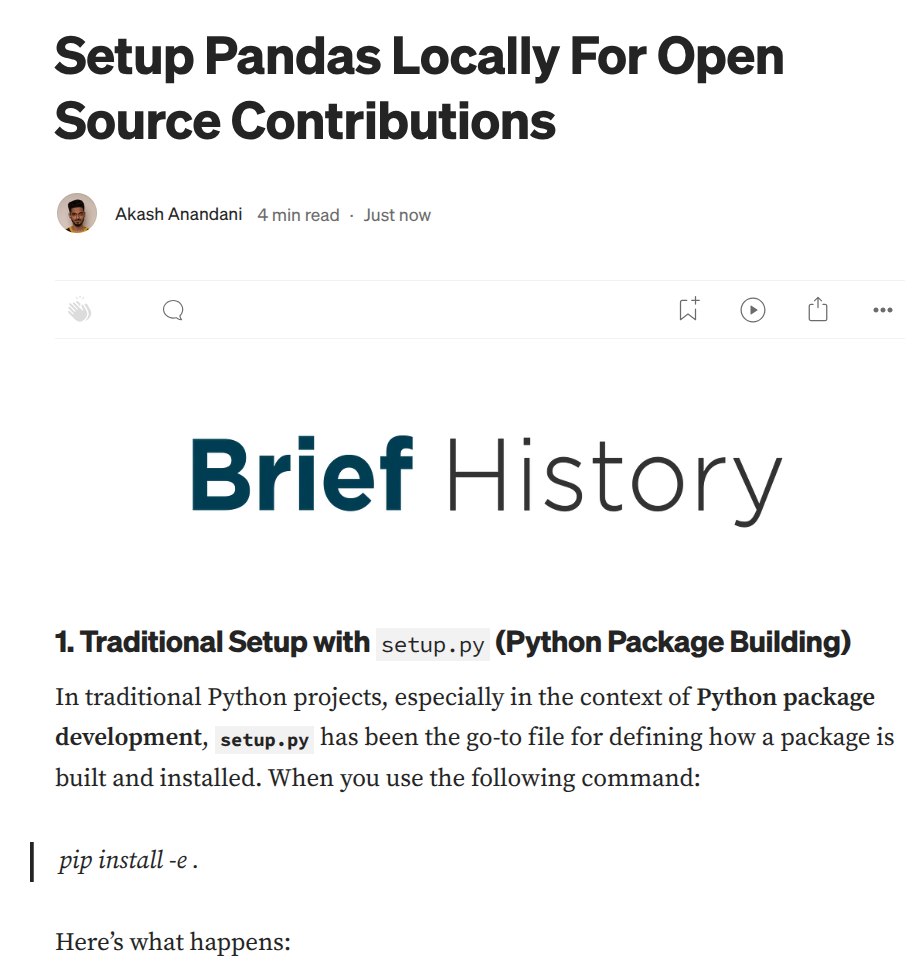

### Git Essentials 🌿
Learned crucial git concepts:
- Rebase vs Merge differences

  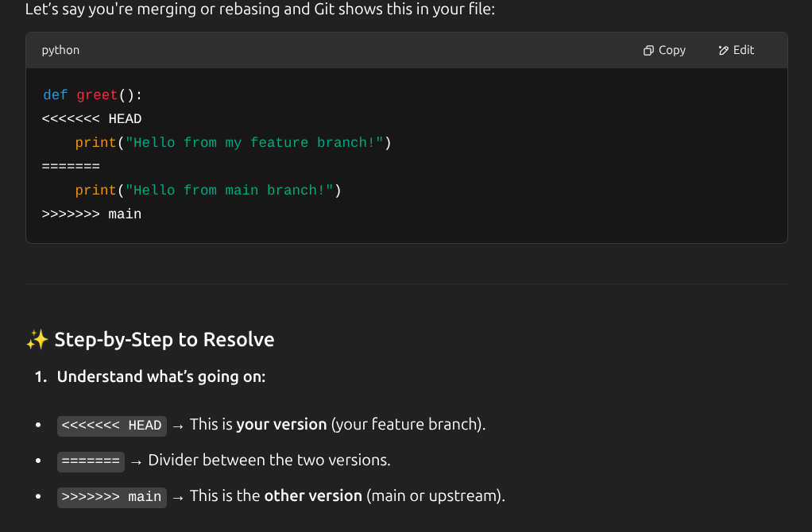
  
- Handling merge conflicts
- Complete open source contribution workflow:
  1. Fork repository
  2. Clone locally
  3. Setup upstream
  4. Sync forked main branch:
     ```
     git checkout main
     git fetch upstream main
     git rebase upstream/main
     ```
  5. Create feature branch
  6. Make changes and commit
  7. Sync with upstream main:
     ```
     git fetch upstream main
     git rebase upstream/main
     ```
  8. Push to forked repo
  9. Create pull request
  10. Merge changes

  

> *A day full of learning and preparation for open source contributions!* 🚀

---


## Wednesday: Let's Get Started! 😎
## Thursday: Let's Get Started! 😎
## Friday: Let's Get Started! 😎
## Saturday: Let's Get Started! 😎
## Sunday: Let's Get Started! 😎
