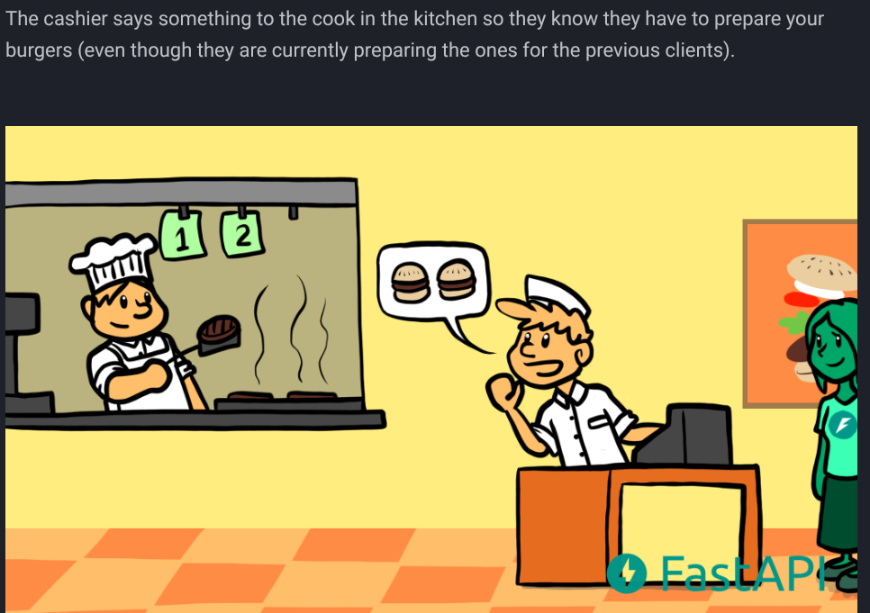

# Week 4 Status Updates

## Monday: Refactoring Adventures

### Python Package Development Code Refactoring 🏃‍♂️

#### Morning Session 🌞
Started the day with a focus on refactoring the code base of sensitive_data_detector package based on the feedback from Amit Sir, making it more efficient and readable learnt how to introduce OOPS concept in the code.


#### Technical Improvements 💪 
- Worked with crucial package functions:
  - Introduced `SensitiveCHecker` Class
  - Introduced various other classes to include OOPS concepts `FileReader` ,`ContentAnalyzer` , `PatternLoader` 
  - Inside each class , introduced methods to handle the file operations, content analysis, pattern matching, etc.
  
 

#### Pull Request & GitHub Issues 📚
- **Detailed Documentation of Feautre Enhancements:** 
Proposed Feature Enhancements in the project by opening a github issue , mentioned all the details about the feature and the implementation plan
    [Github Feature Request Documentation Link](https://github.com/akashdv25/sensitive_data_detector/issues/4)

  

- **Pull Request :** 
After refactoring the code base went ahead and made a PR to merge the changes

    [GitHub Pull Request Link](https://github.com/akashdv25/sensitive_data_detector/pull/5)

  


- **Ci-Cd Success :** 
After refactoring the code base and raising the PR , went ahead and checked the CI-CD pipeline to ensure the code is working as expected , it was a success.

 

  

  

#### Hovering over Licenses 📝

- Learnt about the different types of licenses and their purposes
  
  

  

  

#### Learnings 🎯
Today I learnt about:
- Object oriented approach to code refactoring
- How to introduce OOPS concepts in the code
- Implementing code logic in the classes

> *A day of overcomming challenges and refactoring!* 📈


---
## Tuesday: Open Source & Learning Journey 📚

### Morning Inspiration 🌟
- Received surprise books from Amit sir! 
- One focused on system design concepts other on ML by statquest Joshua Starmer the fascinating thing it was a signed copy from him 

  

  

- I even tagged him on twitter and he replied to me !!

  

### Mentorship Session 💭
Had an insightful session with Amit sir and Div sir where:
- Discussed our current progress and activities
- Amit sir shared valuable lessons from his tech journey
- Key takeaway: Despite obstacles, learning to enjoy the process and believing in yourself is crucial

### Technical Deep Dive 🛠️
#### Pandas Local Setup
- Successfully set up Pandas locally for open source contributions
- Learned about build tools:
  - Meson and Ninja build systems
  - CPython internals
  - Why we're moving from setuptools to meson
  - Migration from setup.py to pyproject.toml

  

#### Open Source Contribution Prep
- Explored Pandas repository's issues section
- Studied:
  - Contribution guidelines
  - Merged PR commits
  - Best practices for commit messages
  - Writing effective PR descriptions

  

### Blog Writing ✍️
Wrote a detailed guide on setting up Pandas locally:
- Published on Medium: [Setup Pandas Locally for Open Source Contributions](https://medium.com/@akashanandani.56/setup-pandas-locally-for-open-source-contributions-582fba71ec55)

  

### Git Essentials 🌿
Learned crucial git concepts:
- Rebase vs Merge differences

  
  
- Handling merge conflicts
- Complete open source contribution workflow:
  1. Fork repository
  2. Clone locally
  3. Setup upstream
  4. Sync forked main branch:
     ```
     git checkout main
     git fetch upstream main
     git rebase upstream/main
     ```
  5. Create feature branch
  6. Make changes and commit
  7. Sync with upstream main:
     ```
     git fetch upstream main
     git rebase upstream/main
     ```
  8. Push to forked repo
  9. Create pull request
  10. Merge changes

  

> *A day full of learning and preparation for open source contributions!* 🚀

---


## Wednesday: Grind & Shine 😎

### Networking & API Development Journey 🌐

### Computer Networking Fundamentals 📡
  
  

Studied networking basics from [GeeksForGeeks](https://www.geeksforgeeks.org/basics-computer-networking/), covering:
- Network architecture
- Basic networking concepts
- Data transmission fundamentals
  
  

### API Deep Dive 🔄
Explored different types of APIs and their use cases:

  

#### 1. REST API
- Representational State Transfer
- Uses HTTP methods
- Stateless architecture
- Most common API type today

#### 2. GraphQL API
- Query language for APIs
- Single endpoint
- Client specifies exact data needs
- Flexible data fetching

#### 3. SOAP API
- Simple Object Access Protocol
- XML-based messaging protocol
- Strict standards
- Used in enterprise systems

#### 4. WebSocket API
- Real-time bidirectional communication
- Persistent connections
- Great for live data/chat apps
- Full-duplex communication

  

  

### HTTP Methods Study 🔀
Learned about core HTTP methods:
- GET: Retrieve data
- POST: Create new data
- PUT: Update existing data
- DELETE: Remove data

### AWS Infrastructure Components ☁️

  

Studied AWS networking basics:
- Virtual Private Cloud (VPC)
  - Private network in the cloud
  - Custom IP range
- Subnets
  - Network segmentation
  - Public vs Private subnets
- Internet Gateway
  - Connection to internet
  - Enable public access

### FastAPI Implementation 🚀
  


  

 learned about fastapi and made my own test server , fast api is a modern, fast (high-performance), web framework for building APIs it uses starlette for the web parts and pydantic for data handling


  

Built my first FastAPI test server:
- Created basic endpoints
- Implemented HTTP methods
- Set up request/response handling
- Explored API documentation using Swagger UI

  

Example of my test server code:
```python
from fastapi import FastAPI

app = FastAPI()

@app.get("/")
def read_root():
    return {"Hello": "World"}

@app.get("/items/{item_id}")
def read_item(item_id: int):
    return {"item_id": item_id}
```

#### Best Practices Learned from Stack Overflow 🎯

  
1. **API Naming Conventions**
   - Use nouns instead of verbs in endpoints
   - Use plural nouns for consistency
   - Examples:
     - ✅ Good: `/users`, `/items`, `/orders`
     - ❌ Bad: `/getUser`, `/createItem`, `/deleteOrder`

2. **Resource Hierarchy**
   - Keep URLs clean and logical
   - Use proper nesting for related resources
   - Example: `/users/{id}/orders`

3. **HTTP Methods Usage**
   - GET for reading
   - POST for creating
   - PUT/PATCH for updating
   - DELETE for removing

4. **Status Codes**
   - 200: Success
   - 201: Created
   - 400: Bad Request
   - 404: Not Found
   - 500: Server Error

   

5. **Query Parameters**
   - Use for filtering, sorting, pagination
   - Keep names clear and consistent
   - Example: `/items?sort=desc&limit=10`

  

> *A productive day of learning modern web technologies and implementing them!* 💻

---


## Thursday: Cloud Deployment & Real-time Communication 🚀

### AWS EC2 Deployment 💻
1. Created and Set Up EC2 Instance
   - Launched new EC2 instance
   - Connected locally using SSH
   - Installed required packages:
     * FastAPI
     * Uvicorn server

   -   

2. Server Deployment
   - Created test FastAPI server
   - Deployed on EC2 instance
   - Accessed using public IPv4 address
   - Tested on port 8000

  

### FastAPI & Pydantic Implementation ⚡

  

- Studied Pydantic for data validation
- Created Pydantic models for API
- Tested API endpoints using Postman
- Followed FastAPI official documentation
- Learnt about async communication in fastapi  through the fastapi documentation and this beautiful story.

  

  

  

  

  

  

  


### Real-time Communication Deep Dive 🌐

  

#### Protocol Study
- Learned about different protocols:
  * TCP (Transmission Control Protocol)
  * UDP (User Datagram Protocol)
  * HTTP vs WebSocket vs WebRTC
- Learnt how tcp is slower but more reliable than udp and how udp is used in real time communication
- Learnt about the webRTC framework which uses udp and how it is used in real time communication

  

#### Voice Agents & Real-time APIs

  

1. **Communication Types**
   - Real-time APIs
   - Custom-built solutions
   - WebSocket implementations

  

2. **LiveKit Exploration**

  

   - Open-source SDK for voice agents
   - Real-time communication features
   - Integration capabilities

3. **WebRTC Framework**

  

   - Open-source technology
   - Uses UDP for faster communication
   - Perfect for real-time audio/video

#### Voice Agent Pipeline
```
User Audio → Speech-to-Text → LLM Token → Text-to-Speech → User Audio
```

  

### Key Learnings 🎯
- EC2 instance deployment
- FastAPI with Pydantic
- Real-time communication protocols
- Voice agent architecture
- WebRTC fundamentals

> *A day full of practical implementations and learning about real-time communication!* 🚀

---

## Friday: Voice Agent Development with VAPI.AI 🎙️

### Project Overview
Created a voice agent system using VAPI.AI after discussing requirements with Anant. The project focuses on making automated calls and handling call data efficiently.


### Technical Implementation 🛠️

#### 1. VAPI Integration Setup
- Explored VAPI.AI documentation
- Learned about making POST requests to VAPI API endpoints
- Key configurations required:
  * VAPI API key
  * Assistant ID (via dashboard/API)
  * Phone number ID

  

#### 2. Phone System Configuration 📞
- Initially tested with VAPI's free number
- Discovered international calling limitations
- Implemented Twilio integration:
  * Created Twilio account
  * Added international calling support
  * Integrated Twilio number with VAPI dashboard
  * Generated phone number ID for API calls

  

#### 3. Server Implementation 🌐
- Built custom server for handling VAPI events
- Set up webhook endpoints for:
  * Call data
  * Chat transcripts
  * Timestamps
  * Call status updates
- Implemented CSV logging for call data

  

#### 4. Public Access Setup 🔄
- Used ngrok for public URL generation
- Enabled VAPI server event reception
- Configured webhook URL in VAPI dashboard
- Successfully tested end-to-end flow

  

### Data Flow Architecture
```python
POST Request → VAPI API → Twilio Call → Server Events → Local CSV
```

### Key Learnings 🎯
- VAPI.AI API integration
- Webhook handling for voice agents
- Twilio international calling setup
- Server event logging
- Public URL tunneling with ngrok

> *Successfully implemented a voice agent system with real-time call handling and data logging!* 🚀

Check out the complete project here: [Voice-Agents Repository](https://github.com/akashdv25/Voice-Agents)

---


## Saturday: Let's Get Started! 😎
## Sunday: Let's Get Started! 😎
