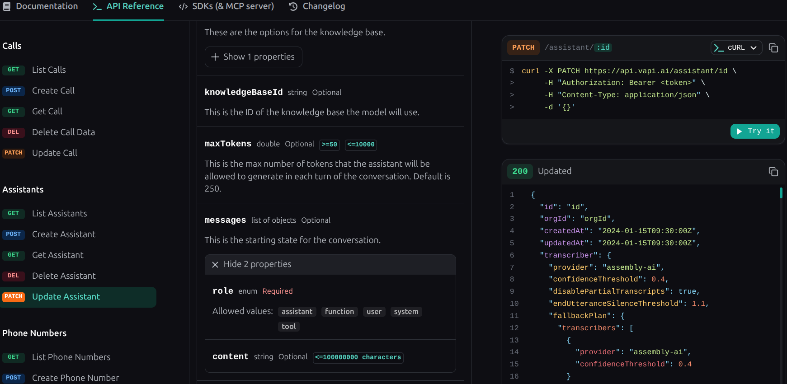
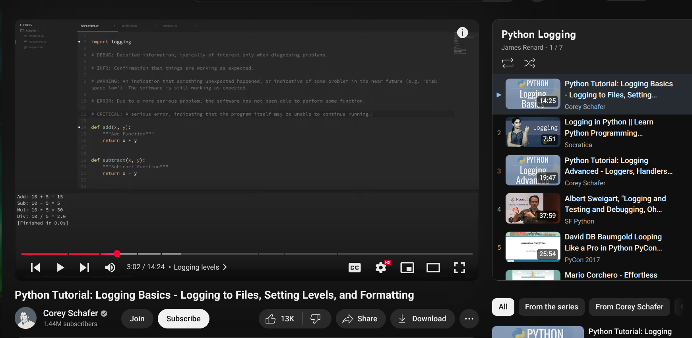
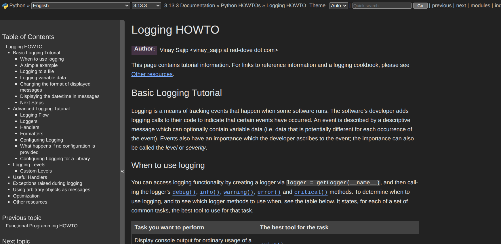
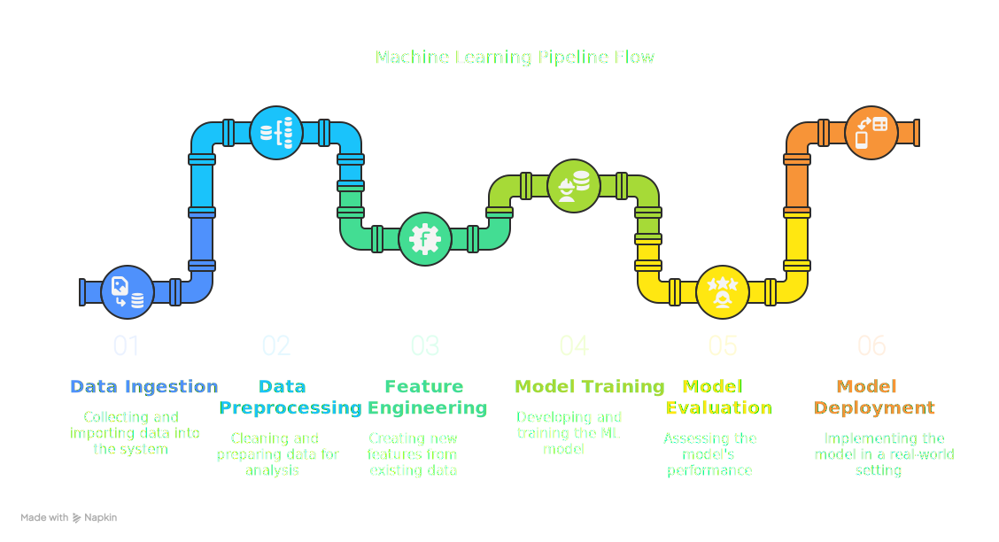

# Week 5 Status Updates

## Monday: New Adventures 🚀

### Voice Agent Development 🎙️

- **Challenge** 🎯: Addressed hallucination issues in the voice agent responses
- **Solution**: Implemented stricter response validation and context management
- **Impact** 💫: Improved response accuracy and reliability
- **Code Refactoring**:
  - 📦 Migrated codebase to use VAPI library for better maintainability
  - 🔍 Explored and integrated new API endpoints from documentation

  
### Learnt about Logging System Implementation 📝
- 📝 Set up structured logging with different log levels
- 📈 Added error tracking and performance monitoring to my E2E ML Pipeline Project
- 🔄 Implemented log rotation and management best practices

### E2E ML Pipeline Project
- 🚀 Started working on a new project to build a complete ML pipeline
- 🔍 It uses pyspark as its core component.
- 📝 I will introduce best practices for logging, monitoring, and managing the pipeline 
- 🌟 This project will be a complete MLops solution , from data ingestion to deployment.

**Repository** 📁: [E2E-ML-Pipeline](https://github.com/akashdv25/E2E-ML-Pipeline)

#### Pipeline Architecture 🏗️
Below is the architectural diagram of our ML pipeline:

#### Key Components 🔑
1. Data Ingestion 📥
2. Data Preprocessing 🧹
3. Model Training 🧠
4. Evaluation 📊
5. Deployment 🚀

