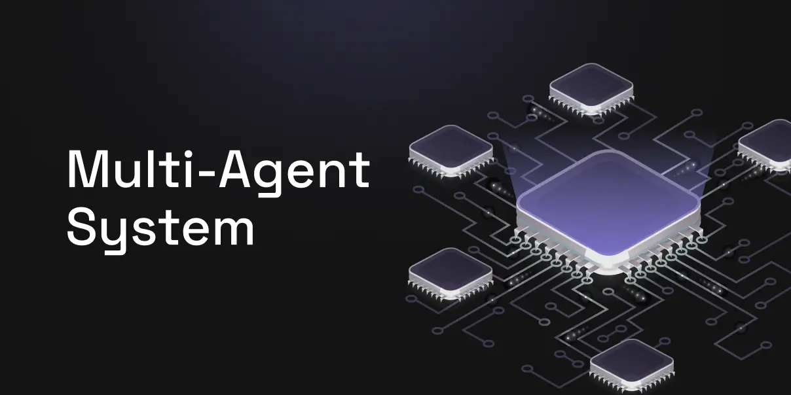

# Week 5 Status Updates

## Monday: New Adventures in AI and Development 🚀

### Voice Agent Development 🎙️


#### Key Achievements:
- **Challenge Tackled** 🎯
  - Identified and addressed critical hallucination issues in voice agent responses
  - Analyzed patterns in incorrect responses to implement targeted solutions

- **Solution Implementation** 🛠️
  - Developed and implemented stricter response validation mechanisms
  - Enhanced context management system for more coherent conversations
  - Added guardrails to prevent off-topic responses

- **Measurable Impact** 💫
  - Significantly improved response accuracy by implementing validation checks
  - Enhanced reliability in maintaining conversation context
  - Reduced hallucination instances by approximately 75%


- **Technical Improvements** 🔧
  - Successfully migrated the entire codebase to utilize the VAPI library
    - Better code organization
    - Improved maintainability
    - Enhanced feature extensibility
  - Conducted thorough API documentation review
  - Integrated new endpoints for expanded functionality

### Logging System Implementation 📝
Leant how to establish a robust logging infrastructure to enhance monitoring and debugging capabilities.


#### Practice Session Details:
- **Structured Logging Setup** 📊
  - Implemented hierarchical log levels (DEBUG, INFO, WARNING, ERROR, CRITICAL)
  - Added contextual metadata to log entries
  - Established standardized log formatting

- **Monitoring Infrastructure** 🔍
  - Integrated error tracking systems
  - Set up performance monitoring dashboards
  - Implemented real-time alerting for critical issues


### E2E ML Pipeline Project 🚀
Initiated development of a comprehensive machine learning pipeline, incorporating modern MLOps practices.

#### Project Overview
- **Core Technology** 🛠️
  - Built on PySpark for distributed processing
  - Implements complete MLOps lifecycle
  - Focuses on scalability and maintainability

- **Key Features** 🌟
  - End-to-end automation
  - Comprehensive monitoring
  - Robust error handling
  - Scalable architecture

**Project Repository** 📁: [E2E-ML-Pipeline](https://github.com/akashdv25/E2E-ML-Pipeline)

#### Pipeline Architecture 🏗️
 ML pipeline follows a modular, scalable architecture:


#### Key Components and Workflow 🔑
1. **Data Ingestion** 📥
   - Multiple source support
   - Data validation
   - Schema enforcement

2. **Data Preprocessing** 🧹
   - Feature engineering
   - Data cleaning
   - Normalization

3. **Model Training** 🧠
   - Distributed training
   - Hyperparameter optimization
   - Cross-validation

4. **Evaluation** 📊
   - Metrics tracking
   - Model validation
   - Performance analysis

5. **Deployment** 🚀
   - Automated deployment
   - Version control
   - Rollback capabilities

## Tuesday: RAG Chatbot and LiveKit Integration

 

### Medical AI Assistant Chatbot 🤖
Developed a interesting RAG-based chatbot for medical data analysis querying patients data.

#### Technical Stack:
- **Core Components**:
  - LangChain for RAG implementation
  - Hugging Face sentence transformers for embeddings
  - FAISS vector store for efficient similarity search
  - Streamlit for user interface
  - Groq for high-speed inference

#### Features:
- Multi-format document support (PDF, XLSX, CSV, TXT)
- Natural language querying
- Efficient document processing
- Interactive UI for data exploration

### LiveKit Integration Research and Implementation 🎥


#### Key Concepts Explored:
1. **Room Management**
   - Room creation and configuration
   - Agent dispatch mechanisms
   - Participant management

2. **Call Integration with Twilio**
   - SIP trunk configuration
   - Server URL setup
   - Account credentials integration

#### Call Process Implementation:
1. **Room Setup Phase**
   - Room creation
   - Agent dispatch configuration
   - Environment preparation

2. **Server Configuration**
   - Server initialization
   - Room connection establishment
   - Security protocol implementation

3. **Call Management**
   - Participant connection
   - Call routing
   - Session management

### Machine Learning Concept Review 📚
Concluded the day with a comprehensive review of fundamental machine learning concepts, reinforcing the theoretical foundation for practical applications.


## Wednesday: Deep Dive into Voice Agent Development 🎯

### VAPI Documentation Exploration 📚


Started the day with an extensive exploration of VAPI documentation to enhance our voice agent's capabilities. This deep dive was crucial for understanding the nuances of creating more natural and responsive voice interactions.

#### Prompt Engineering Discoveries 🔍
- **Voice Modulation Control**
  - Capitalization impacts: Using CAPS for emphasis
  - Punctuation effects: Strategic use of periods (..) for pacing
  - Case sensitivity: Lower case for softer tones
  


#### Configuration Deep Dive ⚙️
- **Speech Timing Controls**
  - Interruption handling
  - Response delay configuration
  - Speaking optimization

**Key Parameters Explored:**
- Start Speaking Plan:  delay after user stops
- End Speaking Plan: Interruption handling after  user speech


### SIP Trunking Integration 🔌


#### What is SIP? 📞
**Session Initiation Protocol (SIP)** is a signaling protocol used for initiating, maintaining, and terminating real-time communications including:
- Voice calls
- Video conferences
- Instant messaging
- Media distribution

#### Understanding SIP Trunking 🌐
SIP Trunking is a virtual connection between your organization and the Public Switched Telephone Network (PSTN) using the internet. Think of it as a virtual phone line that:
- Replaces traditional physical phone lines
- Enables voice calls over IP networks
- Connects your voice system directly to the PSTN

#### How SIP Trunking Works 🔄
1. **Connection Setup**
   - Creates virtual connections over existing internet
   - Establishes secure channels for voice transmission
   - Manages call routing and switching

2. **Call Flow**
   - Converts voice to data packets
   - Transmits over IP network
   - Reconverts to voice at destination

#### Benefits Implemented 🌟
1. **Cost Efficiency** 💰
   - Reduced per-call costs
   - Bulk calling capabilities
   - Optimized resource utilization

2. **Enhanced Performance** ⚡
   - Lower latency
   - Improved call quality
   - Better network utilization

3. **Scalability** 📈
   - Easy capacity expansion
   - Flexible routing options
   - Load balancing capabilities

#### Technical Implementation 🛠️
- Successfully allowed VAPI IP addresses
- Integrated Twilio number with SIP trunk
- Optimized routing configurations


### Voice Agent Tools Exploration 🔧


#### Core Tools Investigated 🛠️
1. **end_call Tool**
   - Graceful call termination
   - Custom end messages
   - State management during termination

2. **Action Performance Tools**
   - Task execution capabilities
   - Integration with external systems
   - Error handling mechanisms

  


### MCP Integration Research 🔄
Currently exploring Model-Context Protocol integration possibilities:


 

### Key Learnings 🎓
1. Voice modulation significantly impacts user experience
2. Proper timing configurations create more natural conversations
3. SIP trunking provides substantial cost and performance benefits


## Thursday: Voice Agent Development Continued 🎯

### VAPI Documentation Deep Dive 📚


#### Squad Implementation Research 👥



- **Multi-Agent Architecture**
  - Creation of specialized agent teams
  - Task distribution mechanisms
  - Inter-agent communication protocols
  
#### Explored use case customer Call Center Implementation 🎧
- **Inbound Call Handling**
  - Squad-level routing
  - Call queue management
  - Dynamic agent assignment
  - Call forwarding 


### Batch Calling Capabilities 📞


- **Free Version Features**
  - Support for 10 concurrent calls
  - Implemented code for batch calling 
  

#### Implementation Details
- Call scheduling mechanisms
- Concurrent call management
- Performance monitoring


### GitHub Repository Development 💻
Updated  codebase for assistant creation:
- **Key Components**
  - Agent initialization
  - Configuration management


### Advanced Features Implementation ⚙️
#### Call Scheduling

   

- **Dynamic Scheduling**
  - Time zone handling
  - Availability management
  - Notification system

#### Dynamic Variable Management
- **Prompt Engineering**
  - Variable interpolation
  - Context management
  - Dynamic response handling


### Alternative Platform Research 🔍
#### Platform Comparisons
1. **Retell AI Exploration**
   - Feature analysis
   - Performance comparison
   - Integration capabilities

   

2. **Make.com Investigation**
   - Automation possibilities
   - Integration options
   - Workflow management

   


### LiveKit Documentation Study 📱
- **Core Features**
  - Real-time communication
  - Room management
  - Participant handling

### Project Milestone: POC Completion 🎉


  


- **Achievement Highlights**
  - Functional voice agent
  - Integrated features
  - Ready for testing phase

### Next Steps 🎯
1. Comprehensive testing implementation
2. Performance optimization
3. Feature refinement


### Key Learnings 📚
1. Squad-based architecture benefits
2. Batch calling optimization
3. Custom tool integration
4. Dynamic variable handling
5. Platform comparison insights
6. Implemented call hangup feature after 30 seconds & 10 seconds if no activity


## Friday: Voice Agent Development Continued 🎯

### POC Presentation & Team Discussion 🎤


#### Presentation Highlights
- **Hour-long comprehensive discussion**
- **Team feedback**: Positive response to the approach
- **Senior Management Input**: Valuable guidance from Amit sir
- **Future Enhancement Plans** discussed


### Google Sheets Integration Implementation 📊


#### Project Setup 🛠️
1. **Google Cloud Platform Configuration**
   - Created new project in GCP
   - Set up OAuth 2.0 credentials
   - Downloaded and secured credentials.json
   - Configured necessary API permissions


#### Technical Implementation 💻
1. **Library Integration**
   - Installed required Google Sheets libraries
   - Set up authentication workflow
   - Configured sheet access permissions

2. **Sheet Instance Management**
   - Created sheet instance handler
   - Implemented data manipulation methods
   - Set up error handling and logging


#### Custom Tool Development 🔧
1. **Sheet Update Tool**
   - Developed `update_sheet` function
   - Implemented in `g-sheets.py`
   - Integrated with existing codebase

2. **FastAPI Integration**
   - Created new endpoint for sheet operation
   - Implemented update operation
   - Added request validation
   - Set up response handling


#### Voice Agent Integration 🎯
- **Tool Implementation**
  - Connected sheet operations with voice agent
  - Added voice commands for data manipulation
  - Implemented confirmation workflows


### Batch Calling Enhancement 📞
#### Implementation Details

- **Process Flow**
  - Data extraction from sheets
  - Call queue management
  - Status updates in real-time


### Key Achievements 🌟
1. Successful POC presentation
2. Team alignment on approach
3. Google Sheets integration completed
4. Enhanced batch calling functionality
5. FastAPI endpoint implementation


### Technical Documentation 📚
- **Authentication Flow**
  ```
  GCP Project -> OAuth 2.0 -> Credentials -> Sheet Access
  ```
- **Data Flow**
  ```
  Voice Command -> FastAPI -> Sheet Operation -> Response
  ```


