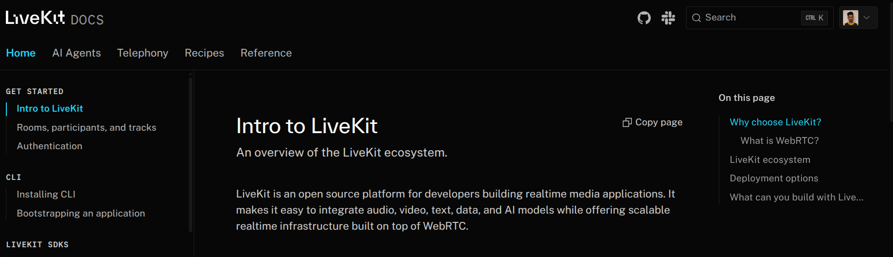
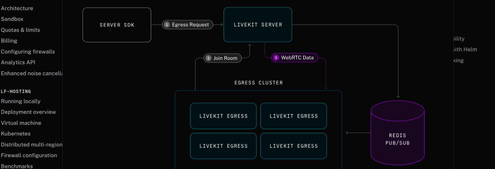
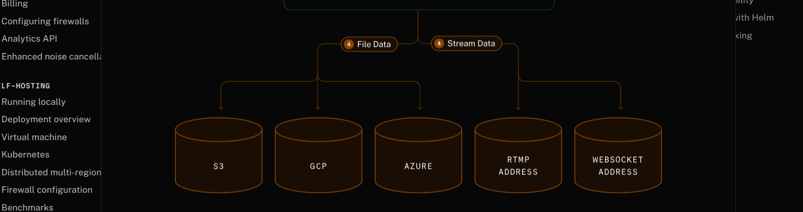
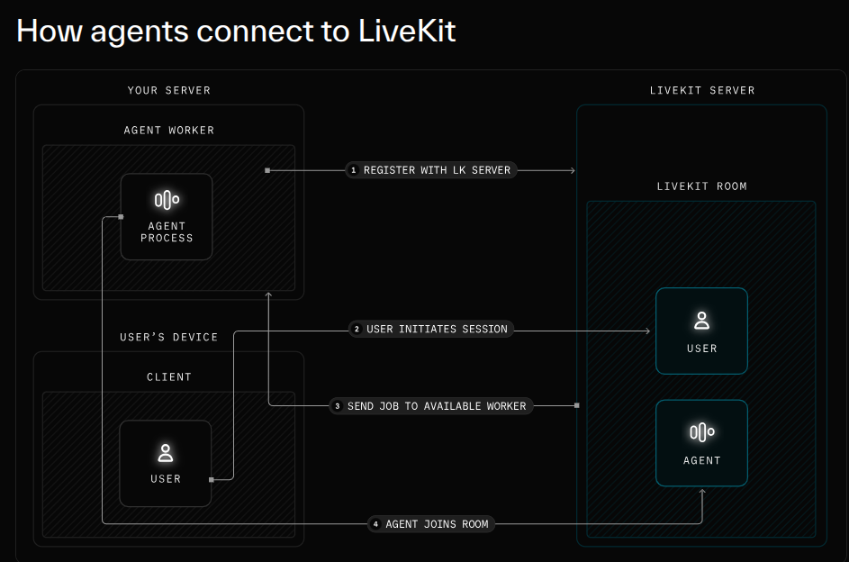
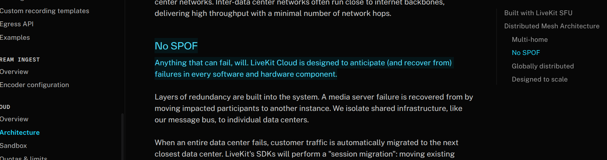
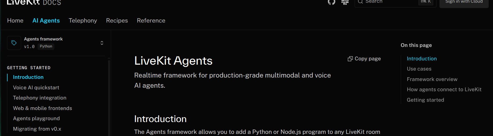
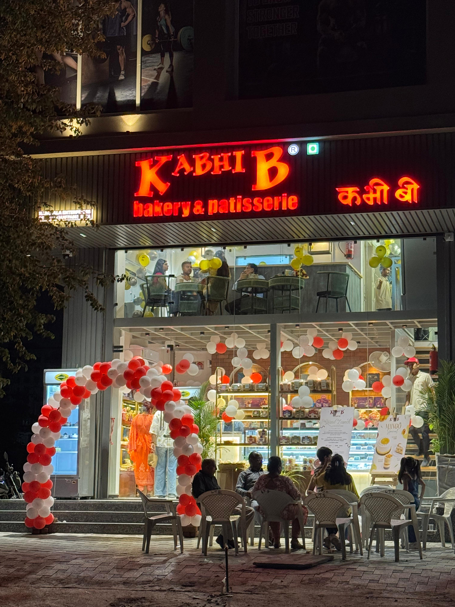
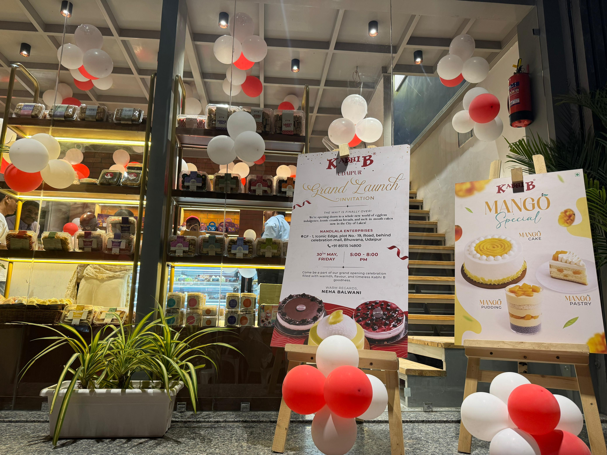

# Week 6: Advancing Voice Agent Development 🚀

## Monday: LiveKit Integration Research 🔍

### Transition from VAPI to LiveKit 🔄

#### Strategic Decision Making 💡
After successfully completing the VAPI voice agent integration, we've identified LiveKit as a more scalable solution for our needs:

- **Cost Analysis**
  - VAPI provides end-to-end solution but at premium pricing
  - LiveKit offers similar capabilities at ~20x lower cost
  - Significant cost advantage for scaling operations

#### LiveKit Architecture Deep Dive 🏗️

- **Global Infrastructure**
  - Network of interconnected media servers
  - Worldwide distribution for low latency
  - WebRTC framework implementation
  - Option for self-hosted or managed solutions

### Core Components Analysis 🔧

#### 1. LiveKit Server 🖥️
- Open-source media server
- Enables real-time communication
- Flexible deployment options:
  - Fully-managed global cloud
  - Self-hosted infrastructure

#### 2. LiveKit SDKs 📱
- Comprehensive development kits:
  - Web integration
  - Native applications
  - Backend systems
- Real-time media handling
- Data streaming capabilities

#### 3. LiveKit Agents 🤖
- Framework for AI agent development
- Multimodal capabilities
- Extensive plugin ecosystem
- Multiple AI provider integrations

### Communication Infrastructure 🌐

#### Telephony Integration 📞
- Flexible SIP integration
- Support for:
  - Inbound calling
  - Outbound calling
  - Room integration
  - Agent session management

#### Media Management 📊
- **Egress Capabilities**
  - Room recording
  - Media export functionality
  
- **Ingress Features**
  - RTMP stream support
  - WHIP protocol integration

### Technical Deep Dive: Protocol Analysis 🔬

#### WebRTC vs Traditional Protocols

1. **WebRTC Advantages** 🚀
   - Peer-to-peer communication
   - Ultra-low latency
   - UDP protocol utilization
   - Optimized for real-time media

2. **Protocol Comparison** 📊

| Metric | TCP (Traditional) | UDP (WebRTC) |
|--------|------------------|--------------|
| Speed | ❌ Slower | ✅ Faster |
| Reliability | ✅ Reliable | ❌ Unreliable |
| Ordered Delivery | ✅ Yes | ❌ No |
| Real-time Use | ❌ Not ideal | ✅ Perfect |

### Core Concepts 📘

#### Room Management 🏠
- Container object for LiveKit sessions
- Manages participant interactions
- Handles media routing

#### Participant Handling 👥
- Unique identity management
- Server-generated SIDs
- Real-time session tracking

### Next Steps 🎯
1. Begin LiveKit implementation
2. Set up development environment
3. Test basic room functionality
4. Integrate AI agent framework

### Key Learnings 📚
- WebRTC advantages for real-time communication
- Cost-benefit analysis of different solutions
- Importance of scalable architecture
- Protocol selection impact on performance

## Tuesday: LiveKit Authentication & Server Setup 🔐

### Authentication Deep Dive 🛡️

#### Access Token Implementation 🎟️
- **JWT-based Authentication**
  - Encodes participant identity
  - Stores room information
  - Manages user capabilities
  - Handles permissions
  - Signed with API secret for security

### Server Deployment Options 🏗️

#### Self-Hosted vs Cloud Comparison

1. **Self-Hosted Server** 🖥️
   - Complete control over infrastructure
   - Recommended for sensitive data
   - Limited global connectivity
   - Manual scaling management
   - In-house maintenance required

2. **LiveKit Cloud** ☁️
   - Managed infrastructure
   - Global server network
   - Automatic scaling
   - Reduced maintenance overhead
   - Built-in monitoring

### Connection Architecture 🌐

#### ICE Protocol Implementation 🧊
- **Connection Negotiation**
  - Optimal path discovery between peers
  - Protocol selection (UDP/TCP)
  - TURN fallback support
  - Best path determination

#### Media Transmission 📡
- **Primary Protocol: UDP**
  - Faster transmission
  - Real-time optimization
  - Lower latency
  - Efficient media handling

### Participant Management 👥

#### Understanding Participants
- **Local Participant**
  - Current user context
  - Local media handling
  - Client-side operations

- **Remote Participant**
  - Other connected users
  - Remote media streams
  - Participant synchronization

### Room Management 🏠

#### Implementation Details
- **Core Components**
  - LiveKit URL configuration
  - API key integration
  - API secret management
  - Server SDK setup

### Webhook Integration 📨

#### Cloud Hosting Setup
- Dashboard configuration
- Event monitoring
- Real-time notifications
- Automated responses

#### Local Hosting Configuration
- **Webhook Section Setup**
  - Config file management
  - Event handling
  - POST request handling
  - JSON event processing

### Key Learnings 📚
1. Token-based authentication flow
2. Deployment strategy considerations
3. ICE protocol functionality
4. Participant management system
5. Webhook implementation methods

### Next Steps 🎯
- Implement authentication system
- Set up webhook handlers
- Configure room management
- Test participant interactions

## Wednesday: LiveKit Egress & Infrastructure Deep Dive 📤

### Egress System Overview 🎥

#### Core Functionality
- **Export Capabilities**
  - Complete room recording
  - Individual track extraction
  - Consistent API interface
  - Flexible output options

#### Deployment Options 🚀

1. **LiveKit Cloud Users**
   - Ready-to-use integration
   - Zero configuration needed
   - Managed infrastructure
   - Automatic scaling

2. **Self-Hosted Setup**
   - Separate component deployment
   - Custom configuration required
   - Infrastructure management
   - Flexible installation options

### Infrastructure Reliability 🏗️

#### No Single Point of Failure (SPOF) Architecture
- **Fault-Tolerant Design**
  - Anticipates hardware failures
  - Automatic recovery systems
  - Component redundancy
  - Distributed architecture

## Thursday: LiveKit Agents Framework 🤖

### Agent Framework Introduction 🎯

#### Core Features
- **Realtime Processing**
  - Production-grade implementation
  - Multimodal capabilities
  - Voice AI integration
  - Stateful operations

#### Bridge Architecture 🌉
- **AI Model Integration**
  - Data center connectivity
  - Reliable network operations
  - Mobile network adaptation
  - Quality variance handling

### Technical Implementation 💻
- **State Management**
  - Real-time updates
  - User connection handling
  - Network quality adaptation
  - Performance optimization

### Key Learnings 📚
1. Egress system capabilities
2. Infrastructure reliability patterns
3. Agent framework architecture
4. Network adaptation strategies

### Next Steps 🎯
- Implement egress functionality
- Set up redundancy systems
- Configure agent framework
- Test mobile network scenarios

## Weekend: Family Celebration & Rejuvenation 🌟

### Sister's Bakery Inauguration 🎂

#### Udaipur Adventure 🏰
After an intensive month of development and learning, took a well-deserved break to attend a special family milestone:
- Traveled to the City of Lakes
- Celebrated sister's entrepreneurial journey
- Witnessed the bakery inauguration
- Supported family's new venture

### Mind Refreshing Break ✨
The trip provided a perfect opportunity to:
- Reset and recharge
- Connect with family
- Experience new surroundings
- Gain fresh perspectives

### Back with Renewed Energy 🚀
This break after a month of continuous work has:
- Refreshed creativity
- Restored focus
- Enhanced motivation
- Ready for new challenges

_Looking forward to bringing this renewed energy to next week's development tasks!_ 💪

