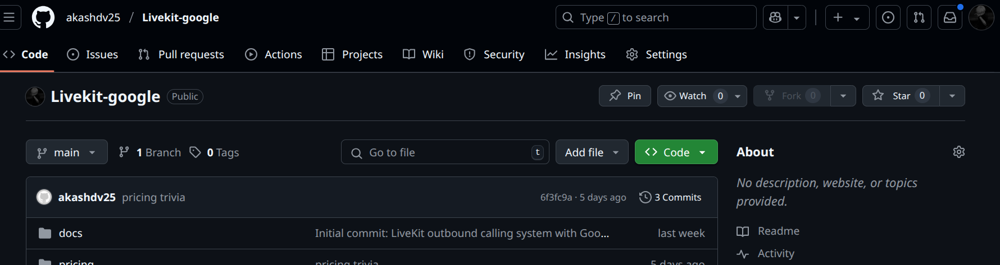
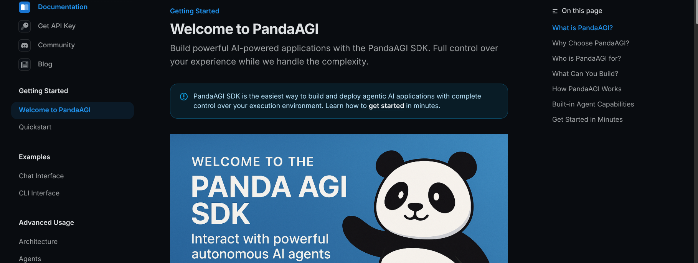
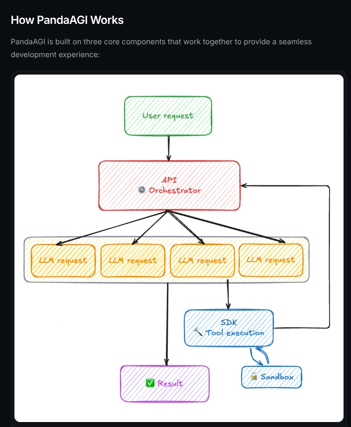
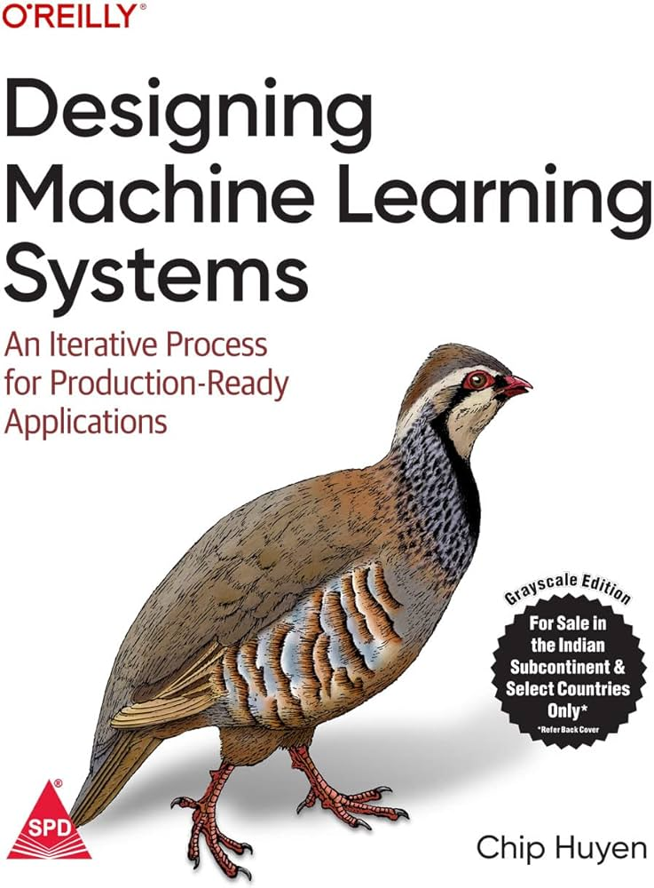
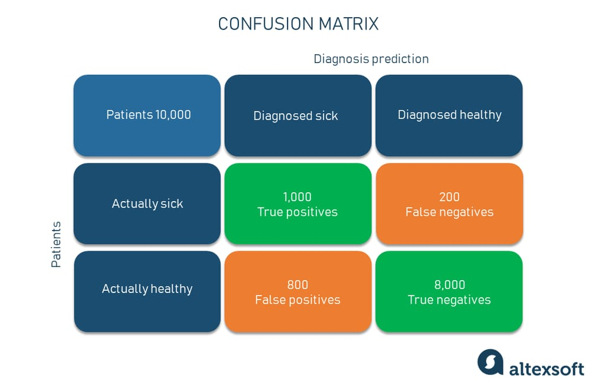

# Week 7: Voice Agent Implementation & Integration 🚀

## Monday: LiveKit Voice Agent Development 🎯

### Voice Agent Implementation Success 🌟

Successfully implemented a complete voice agent system integrating LiveKit with Google Sheets, creating an automated outbound calling solution.

#### System Architecture 🏗️

1. **Dispatch System Implementation** 📞
   - Google Sheets data extraction
   - Automated room creation
   - SIP participant management
   - Outbound call handling

2. **Conversation Agent Development** 🤖
   - Real-time conversation management
   - Customer detail verification
   - Dynamic data updates
   - Call lifecycle handling

#### Integration Flow 🔄

1. **Initial Setup** 🚀
   - Dispatch calls initiates the process
   - Room creation in LiveKit
   - Agent initialization

2. **Call Execution** 📱
   - Participant connection
   - Room joining sequence
   - Real-time communication establishment

3. **Data Management** 📊
   - Google Sheets verification
   - Real-time data updates
   - Information confirmation

### Project Resources 📚

#### Documentation & Demo 🎥
- 💻 **GitHub Repository**: [LiveKit-Google](https://github.com/akashdv25/Livekit-google)
- 🎥 **Implementation Demo**: [LiveKit Voice Agent Demo](https://www.loom.com/share/a6b6de54e2ea4956adb67708b51ca26b)

## Tuesday: API Security & Character Encoding Deep Dive 🔒

### Security & Encoding Research 🛡️

Conducted comprehensive research and documentation on critical web security and encoding concepts, focusing on practical implementations and best practices.

#### Key Areas Explored 📚

1. **API Security** 🔐

   - OWASP security principles
   - Authentication vs Authorization
   - Security best practices implementation
   - API endpoint protection strategies

2. **Character Encoding Systems** 💻

   - Unicode vs ASCII comparison
   - UTF encoding variations
   - Implementation considerations
   - International character support

3. **Internationalization (i18n)** 🌍
   - Multi-language support
   - Character encoding handling
   - Localization strategies
   - Cultural considerations

### Documentation & Resources 📝

#### Published Content 📖
- 📝 **Blog Post**: [How Characters Become Code and Code Stays Secure](https://medium.com/@akashanandani.56/how-characters-become-code-and-code-stays-secure-307e6593e14e)

## Wednesday: Pandas-AGI SDK Exploration 🤖

### Pandas-AGI Framework Research 🛠️

Started exploring Pandas-AGI, an innovative SDK designed to simplify and streamline the process of building autonomous agents.

#### Project Overview 🎯

1. **SDK Capabilities** 💡
   - Simplified agent development
   - Built-in agent templates
   - Rapid prototyping tools
   - Agent behavior customization

2. **Key Features** ⚙️
   - Agent lifecycle management
   - Task orchestration
   - State management
   - Event handling system

3. **Development Benefits** 🚀
   - Reduced development time
   - Standardized agent patterns
   - Easy integration capabilities
   - Scalable agent architecture

### Project Resources 📚

#### Documentation & Repository 💻
- 🔗 **GitHub Repository**: [Pandas-AGI Framework](https://github.com/akashdv25/Pandas-agi)
- 📖 **Purpose**: A comprehensive SDK for building and deploying autonomous agents with ease

## Thursday: Machine Learning Systems Deep Dive 📚

### ML Systems Research & Analysis 🔬

Engaged in comprehensive study of machine learning systems, focusing on the practical aspects of ML in production environments versus research settings.

#### Key Learning Areas 📋

1. **Research vs Production ML** 🎯
   - Trade-offs between accuracy and performance
   - Production-specific considerations
   - Model complexity implications
   - Real-world deployment challenges

2. **System Bottlenecks** ⚡
   - Development bottlenecks in training
   - Deployment bottlenecks in inference
   - Latency optimization strategies
   - Performance tuning considerations

3. **Data Management** 💾
   - NoSQL approaches
     - Graph models
     - Document models
   - OLTP vs OLAP comparisons
   - ACID compliance requirements

4. **ML Operations** 🛠️
   - H2O AutoML capabilities
   - Model selection strategies
   - Labeling approaches
     - Weak supervision
     - Labeling heuristics
   - Transfer learning applications

### Study Resources 📚

#### Technical Focus Areas 📖

- 🏷️ **Labeling**: Regex and keyword matching strategies
- 🔄 **Transfer Learning**: Application in production systems

## Friday: ML Model Evaluation & Optimization 📊

### Model Performance Analysis Deep Dive 📈

Conducted in-depth study of critical machine learning evaluation metrics and techniques for handling imbalanced datasets, focusing on practical applications in real-world scenarios.

#### Key Concepts Studied 🎯

1. **Class Imbalance Handling** ⚖️
   - Problem: When one class significantly outnumbers others
   - Impact: Models biased towards majority class
   - Solutions:
     - SMOTE (Synthetic Minority Over-sampling Technique)
     - Under-sampling majority class
     - Class weights adjustment

2. **Evaluation Metrics** 📏
   - ROC (Receiver Operating Characteristic)
     - True Positive Rate vs False Positive Rate
     - Area Under Curve (AUC) interpretation
     - Threshold selection strategies
   
   - Precision-Recall Trade-off
     - Precision: Accuracy of positive predictions
     - Recall: Ability to find all positive instances
     - Use cases for different business needs

   - F1 Score
     - Harmonic mean of precision and recall
     - When to prefer F1 over accuracy
     - Balanced evaluation for imbalanced datasets

3. **Feature Engineering** 🛠️
   - Missing Value Treatment
     - Imputation strategies
     - Mean/median/mode replacement
     - Advanced techniques for different data types

### Practical Applications 💡

#### Implementation Scenarios 🔍
- 📊 **Healthcare**: Handling rare disease detection
- 💳 **Finance**: Fraud detection in imbalanced transactions
- 📱 **User Behavior**: Rare event detection in user interactions

#### Best Practices 📚
- Choose metrics based on business impact
- Consider cost of false positives vs false negatives
- Validate models with appropriate cross-validation strategies

## Saturday: Tools Exploration & Project Completion 🛠️

### Tools & Frameworks Research 🔍

Explored various tools and frameworks for ML pipelines, voice agents, and document processing.

#### Technology Exploration 📚

1. **Chatterbox Framework** 🗣️
   - Open source voice LLM agent framework
   - Developed by Resemble.ai
   - Voice interaction capabilities
   - LLM integration features

2. **PDF Processing Integration** 📄
   - PDFPlumber implementation
   - Text extraction capabilities
   - Integration with medical assistant RAG
   - Document processing workflow

3. **ML Systems Components** 🔄
   - Pipeline stages exploration
   - End-to-end workflow analysis
   - Component integration strategies
   - System architecture design

4. **Data Version Control (DVC)** 📦
   - Hands-on implementation
   - Version control for ML datasets
   - Pipeline tracking
   - Repository: [DVC Test Project](https://github.com/akashdv25/dvc-test)

### Project Completion 🎯

#### E2E ML Pipeline Implementation ⚙️
- Comprehensive pipeline development
- Full implementation and testing
- End-to-end workflow integration
- Repository: [E2E ML Pipeline](https://github.com/akashdv25/E2E-ML-Pipeline)

## Sunday: Data Serialization Deep Dive 📝

### Data Format Comparison Study 🔍

Explored and compared different data serialization formats, focusing on JSON and YAML, their relationships, and use cases.

#### Format Analysis 📊

1. **JSON (JavaScript Object Notation)** 📋
   - Characteristics:
     - Simple and lightweight
     - Native JavaScript support
     - Widely used in web APIs
     - Smaller file size
   - Best For:
     - Web applications
     - API data exchange
     - Configuration files
     - Cross-platform communication

2. **YAML (YAML Ain't Markup Language)** 📘
   - Characteristics:
     - Human-readable format
     - Support for complex data types
     - Comment support
     - Superset of JSON
   - Best For:
     - Configuration files
     - Documentation
     - Complex data structures
     - Human-edited files

#### Key Insights 💡

1. **Format Relationships** 🔄
   - YAML is a superset of JSON
   - All JSON files are valid YAML
   - Not all YAML files are valid JSON
   - Easy conversion between formats

2. **Selection Criteria** 🎯
   - Use JSON for:
     - API responses
     - Data transmission
     - Browser interactions
   - Use YAML for:
     - Config files
     - Documentation
     - Human-edited content

### E2E ML Pipeline Project Completion 🎯

Repository: [E2E ML Pipeline](https://github.com/akashdv25/E2E-ML-Pipeline)

Completed a comprehensive end to end ml pipeline project , includes aws s3 for storage , pyspark for distributed computing , DVC for data version control  .

### Week 7 Completion 🎉

Successfully completed the week with comprehensive learning across:
- Voice agent implementation
- ML systems and evaluation
- Data serialization formats
- Tool exploration and integration

Thank you for following along with Week 7! Looking forward to more exciting developments ahead. 🚀

